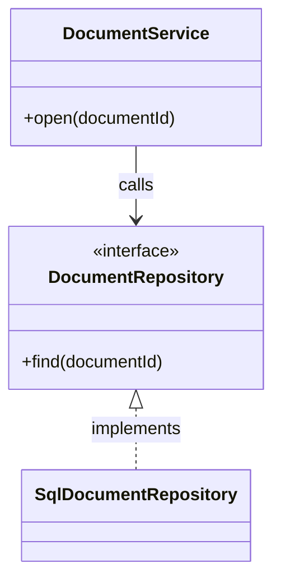
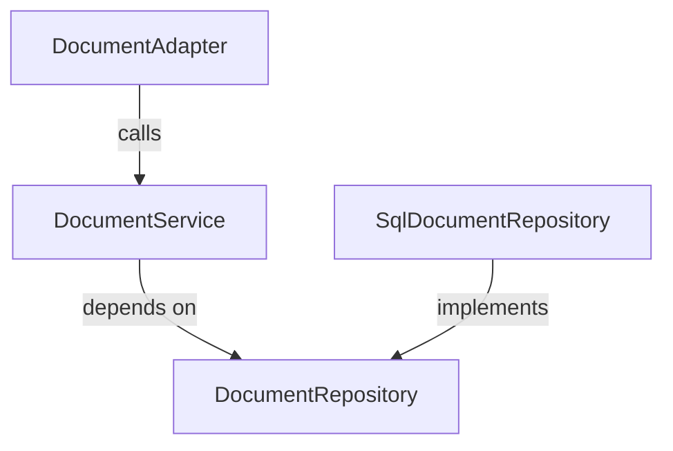
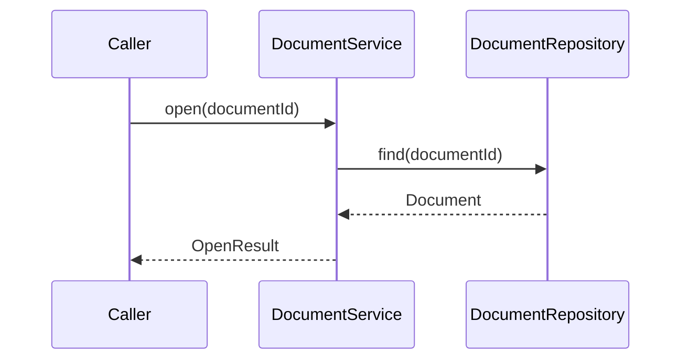
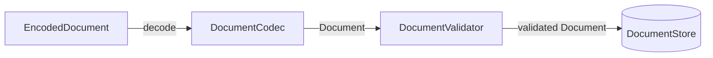
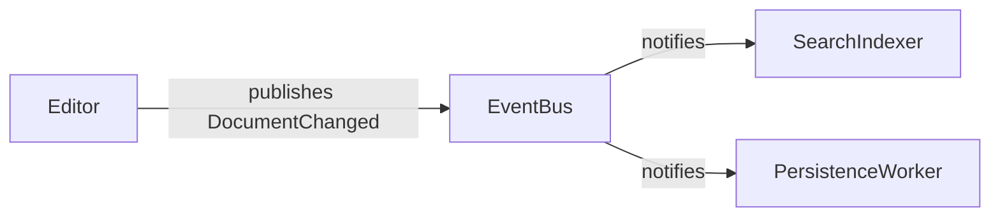
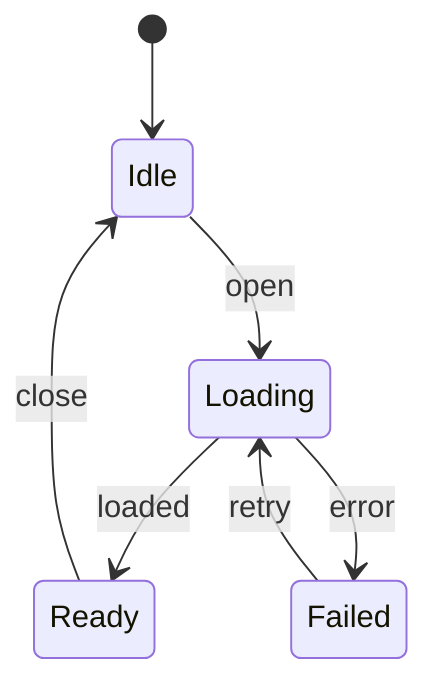
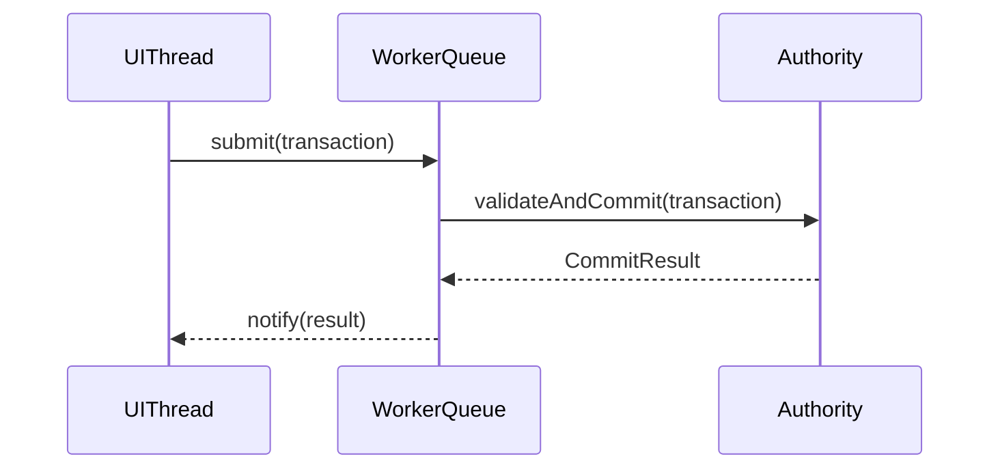
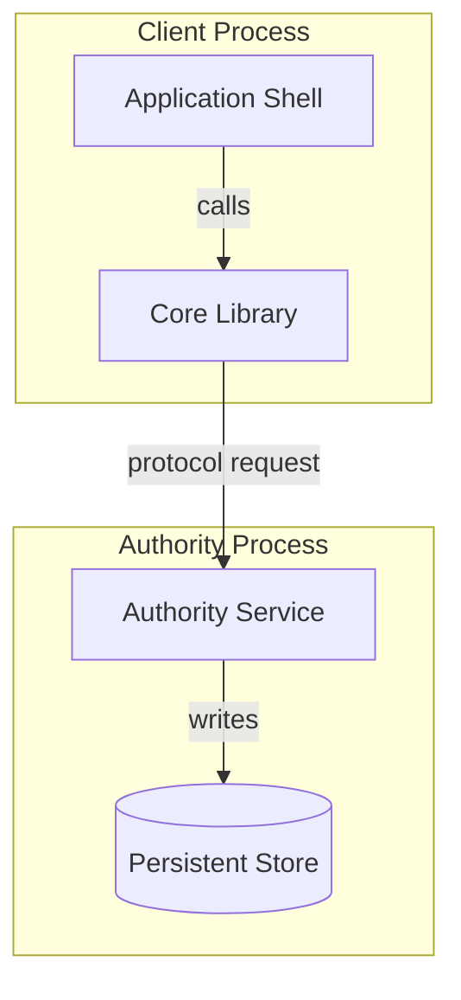
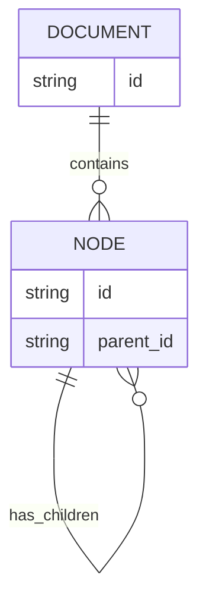

# Mermaid 架構圖樣式

只讀取與已選架構視角相符的章節。所有名稱換成程式中的真實符號，不照抄範例名稱。

## 類別架構

只列出能解釋關係的關鍵成員，不把完整 API 複製進圖。

## 模組與依賴架構

箭頭方向表示程式依賴方向；若要表達資料流，另畫資料流圖。

## 呼叫鏈與互動時序

同步呼叫使用實線箭頭，回傳使用虛線箭頭；條件分支使用 `alt`，避免把每個小函式都列為 participant。

## 資料流架構

節點表示處理階段或儲存邊界，箭頭標示實際資料形狀或轉換。

## 事件架構

若重點是發送、排程、重試與回覆的先後順序，改用 `sequenceDiagram`。

## 狀態架構

轉移標籤使用真實事件或條件；不要把一般函式呼叫誤畫成狀態。

## 並行與非同步架構

participant 使用真實執行緒、queue、actor 或程序名稱；用 `Note over` 標示執行緒切換或排程保證。

## 執行期與部署架構

`subgraph` 表示程序、主機或信任邊界；不要混用成一般視覺分組。

## 資料模型架構

只有資料關聯是核心問題時才使用 `erDiagram`；行為與依賴改用類別圖或模組圖。

## 共通語法規則

- 使用 ASCII 節點 ID，例如 `document_service`；標籤可使用中文、空格與真實符號名。
- 標籤含括號、冒號、斜線或標點時使用雙引號。
- 同一張圖維持單一主方向；避免交叉箭頭與無意義的雙向線。
- 實作與繼承使用 Mermaid 對應關係；呼叫、事件與資料流使用有動詞的邊標籤。
- 省略與核心問題無關的欄位、工具函式、框架內部與第三方細節。
