# Display list 邊界：產出與借用資料流

## 範圍

- 核心問題：核心如何在不暴露物件圖與 ownership 的情況下安全交付一幀。
- 納入：encoder、validator、雙緩衝、C ABI span 與 Flutter renderer。
- 不納入：個別繪圖 opcode payload 與 GPU backend。

## 架構圖

```mermaid
flowchart LR
  snapshot["DocumentRevision and layout result"] -->|encode commands| encoder["DisplayListEncoder"]
  encoder -->|write incomplete frame| back["Back buffer"]
  back -->|validate header and commands| validator["DisplayListValidator"]
  validator -->|atomic publish on success| front["Front buffer"]
  front -->|borrow const span and frame token| abi["C ABI"]
  abi -->|draw values only| shell["Flutter renderer"]
  validator -->|failure keeps previous front| front
```

## 證據

- `spec/decisions/07-binding/BND-0001-display-list-buffer-command-and-version.md`：格式與 lifetime 契約。
- `spec/decisions/00-foundation/FND-0002-c-abi-error-memory-and-threading.md`：C ABI、status 與 ownership。
- `tasks/p0-spike-report.md`：display list 作為 FFI 邊界的可行性證據。

## 具體例子

Front 是 token 71，Flutter 正在讀取。核心只寫 back；驗證成功後交換並發布 token 72。若 back 的
第三個 command 長度越界，交換不發生，Flutter 下一次取得的仍是完整 token 71，而不是半個 72。

## 閱讀說明

- 外殼持有的是 borrowed span，不是 owning buffer；下一次成功 publish 後舊 pointer 失效。
- Validator 是 publish gate，不能讓 renderer 邊讀邊發現格式錯誤。
- Flutter renderer 只能消費幾何與樣式值，不查 ObjectStore，也不補 layout 規則。

## 術語

| 名詞 | 具體意義 |
|---|---|
| Front buffer | 最近一次完整驗證並發布、可供外殼讀取的 buffer |
| Back buffer | 核心正在建構、外殼不可見的 buffer |
| frame token | 成功發布才增加的單調序號 |
| borrowed span | 指向核心記憶體的唯讀暫時視圖，外殼不取得釋放責任 |
