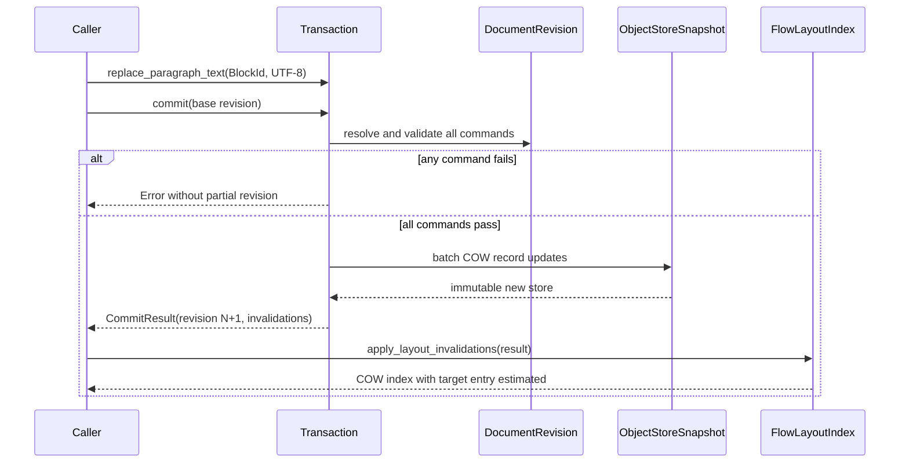

# 編輯 Transaction：提交與 layout 失效資料流

## 範圍

- 核心問題：一次 Paragraph 修改如何原子發布，並只失效對應 layout entry。
- 納入：`Transaction`、`ParagraphRecord`、`DocumentRevision`、`LayoutInvalidation`、
  `FlowLayoutIndex`。
- 不納入：undo stack 容器、shaping 實作與 Flutter command encoding。

## 架構圖

## 證據

- `spec/decisions/04-editing/EDT-0001-selection-transaction-and-undo.md`：原子性與拒絕規則。
- `spec/decisions/02-layout/LAY-0002-invalidation-offset-and-viewport-index.md`：snapshot 與 COW layout。
- `include/krepis/document_revision.hpp`：現有不可變 revision 邊界。
- `include/krepis/flow_layout_index.hpp`：現有 prefix extent COW index。

## 具體例子

50,000 個 Block 中修改位置 37,421 的 Paragraph：Transaction 建立一個新 record page 短路徑並發布
revision 102。失效套用由 LocationIndex 找到 owner／leaf，在 leaf 內定位 Block，僅複製該 layout leaf
與祖先；位置 37,422 之後不寫入新絕對 `y`。目標 entry 暫時保留舊高度 28 作 estimate，重測為 44
後只更新 prefix 聚合路徑。

## 閱讀說明

- `CommitResult` 同時帶新 revision 與明確 invalidation，不靠比較整份文件推測。
- LayoutIndex 是衍生 cache，套用失敗可以丟棄並由 FlowSequence 重建，不回滾權威 revision。
- 同 position 的 BlockId 不一致時 fail closed，避免把 A 的高度套到 B。

## 術語

| 名詞 | 具體意義 |
|---|---|
| batch COW | 所有命令驗證後，對受影響 immutable page／tree path 建立新版本 |
| LayoutInvalidation | BlockId、來源 content revision 與最早失效階段的值型別 |
| estimated entry | 尚未重測，暫以舊高度維持 viewport 的 layout cache entry |
| fail closed | 不一致時拒絕套用，不猜測修補位置或內容 |
