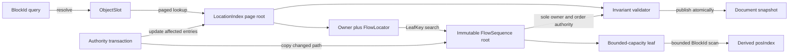
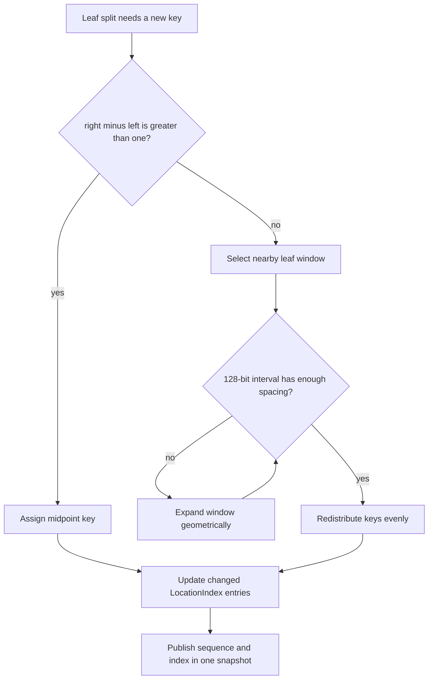
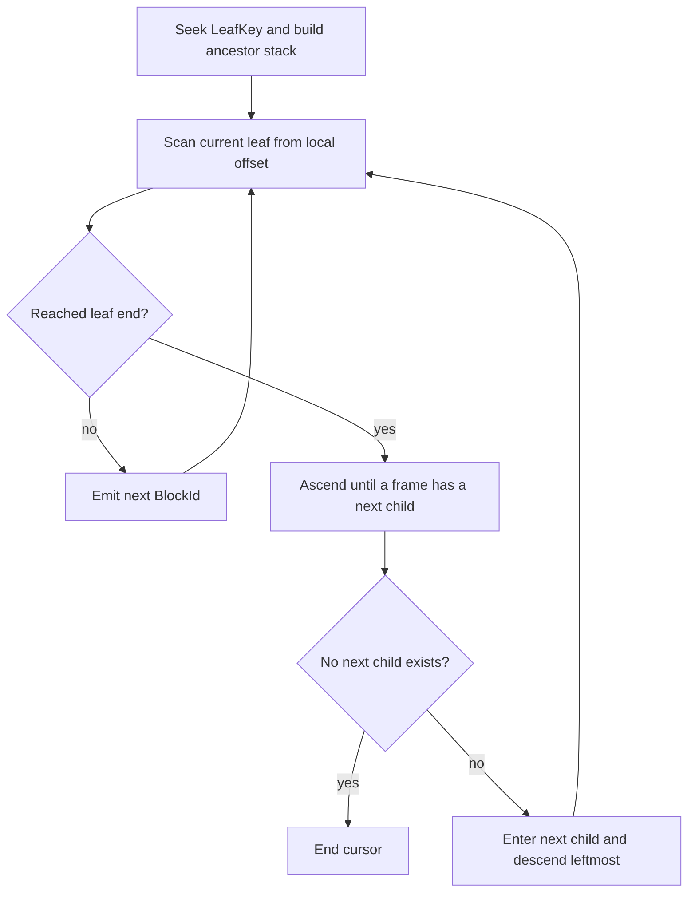

# FlowSequence：位置索引、排序標籤與走訪架構

## 範圍

- 說明 FlowSequence、LocationIndex、LeafKey 與 TreeCursor 如何合作。
- 說明插入、leaf split、局部 relabel、redistribution 與 merge 的演算法流程。
- SpatialContainer 不使用 LeafKey；其唯一位置權威是 placement，本文件只處理 FlowContainer。
- Leaf 容量、fanout、low-water mark 與 relabel window 是 benchmark 參數，不在本文件猜定。

## 單一權威與查找資料流



FlowSequence 是 owner 與順序的唯一權威。LocationIndex 只把 `BlockId` 快速導向 owner 與 leaf；它
可以重建，也不能反過來修改 FlowSequence。兩者不一致時，authority 拒絕發布 snapshot。

### 具體例子：索引不得覆寫順序

```text
FlowSequence(PageA) = [A, B, C]
LocationIndex[B]    = { owner = PageB, leaf_key = K90 }
```

這不是「B 應該搬到 PageB」，而是 invariant failure。載入時以 FlowSequence 重建索引；交易中則
整筆 commit 失敗，避免錯誤被靜默合理化。

## LeafKey 與局部 relabel

`LeafKey` 是 128-bit 稀疏排序標籤，由 `{uint64_t high, uint64_t low}` 組成並按 unsigned
lexicographic order 比較。它是 authority 內部 locator，不是物件身分。



### 具體例子：一般 split

```text
K10 = 1000
K11 = 2000

K10 split 後：
left leaf  保留 1000
right leaf 取得 1500
原 K11     仍是 2000
```

只需更新移到新 leaf 的 Block。原本仍在 left leaf 的 Block 繼續指向相同 LeafKey。

### 具體例子：沒有可用中點

```text
原 keys：1000, 1001, 1002, 1003
局部 relabel：1000, 2000, 3000, 4000
```

如果目前 window 的 128-bit 區間仍不足，就把 window 大小幾何擴張，例如 4、8、16 個 leaves，直到
能重新留下間距。受影響 leaves 中所有 LocationIndex entries 必須同 transaction 更新。

## ObjectSlot-indexed LocationIndex

```text
LocationIndexSnapshot {
    page_table_root
}

LocationEntry = empty
    | { owner_container_id, FlowLocator { leaf_key } }
    | { owner_container_id, SpatialLocator { placement_key } }
```

`ObjectId` 先經 IdDirectory 解析成固定 `ObjectSlot`，再用 slot 的 page number 與 offset 查表。更新
entry 時只 copy-on-write 一個 LocationPage 與 page-table 的短路徑。

### 具體例子：只複製一頁

假設每頁容量暫以 256 示意，`ObjectSlot 520` 位於 page 2、offset 8。Block 從 leaf K20 移到 K30 時：

```text
Revision 42：Page 2 → { slot 520 = K20 }
Revision 43：Page 2' → { slot 520 = K30 }

Page 0、Page 1、Page 3... 由兩個 revision 共用。
```

數字 256 只是例子；正式容量必須由 cache locality、copy cost 與記憶體 benchmark 決定。

## TreeCursor 連續走訪



TreeCursor 保存 `snapshot_handle`、ancestor frames、current leaf 與 local offset。Snapshot root 保證
所有借用 node pointer 的生命週期；cursor 不能跨 SnapshotId 使用。

### 具體例子：從 Leaf 2 走到 Leaf 3

```text
Root
├─ Branch 0
│  ├─ Leaf 0
│  └─ Leaf 1
└─ Branch 1       <- ancestor frame 記住 child index
   ├─ Leaf 2      <- current
   └─ Leaf 3      <- next
```

Leaf 2 掃完後，cursor 回到 Branch 1，將 child index 從 0 改為 1，再下降到 Leaf 3。不需要 persistent
`next` pointer，因此 split 不會迫使前一個 leaf 連鎖複製。

## 有遲滯的延遲重平衡

`Hysteresis` 是使用不同的進入與離開門檻，避免資料量在邊界附近時反覆切換狀態。此處用於抑制
split／merge 震盪。

處理順序：

1. Leaf 超過最大容量才 split，並約略平均分配。
2. 刪除後若仍高於 low-water mark，不做結構調整。
3. 低於 low-water mark 時，先嘗試與鄰居 redistribution。
4. Redistribution 無法讓雙方回到允許區間時才 merge。
5. Internal node 套用同一原則；root 只剩一個 child 時可以降高。

### 具體例子：避免 delete／undo 震盪

假設容量 8、low-water mark 2，僅作流程示意：

```text
9 entries  → split 成 4 + 5
刪除到 3  → 不 merge
undo 回 4 → 不 split
刪除到 2  → 才嘗試 redistribution／merge
```

若採「低於一半立即 merge」，3 與 4 之間的 delete／undo 可能反覆 merge／split，造成 COW 配置與
LocationIndex 更新震盪。

## 術語

| 名詞 | 具體意義 |
|---|---|
| Authority | 唯一可核准並發布文件狀態的核心；client 不能覆寫其結果 |
| Invariant | 每個已發布 snapshot 都必須成立的條件，例如一個 Block 至多一個 owner |
| Chunked B+ tree | Internal node 保存 child 聚合值，leaf 以連續陣列保存多個 BlockId 的平衡樹 |
| Immutable node | 發布後不能原地修改的節點；修改必須建立新版本 |
| Copy-on-write（COW） | 只複製被修改路徑，未改 subtree 由新舊 revision 共用 |
| Leaf | B+ tree 最底層 chunk；保存一段連續 BlockId |
| Internal node | 保存 children、subtree counts 與 subtree extents 的非葉節點 |
| LeafKey | 固定 128-bit 的內部稀疏排序標籤，用來找到邏輯 leaf |
| Midpoint insertion | 以左右排序標籤的中點配置新 key |
| Local relabel | key 空間不足時，只重新均勻編號附近 leaf window |
| LocationIndex | 由 BlockId 導向 owner 與內部 locator 的可重建加速索引 |
| ObjectSlot | ObjectId 在某個 IdDirectory generation 中對應的內部整數位置 |
| Paged COW table | 以固定容量 page 分組，修改時只複製受影響 page 的 persistent table |
| TreeCursor | 綁定單一 snapshot、保存 ancestor stack 的順序走訪器 |
| Amortized O(1) | 單次偶爾較貴，但連續一批操作平均為固定成本 |
| Hysteresis | 以不同門檻避免狀態在邊界附近反覆切換 |
| Low-water mark | 低於此占用量才觸發 redistribution／merge 的門檻 |
| Redistribution | 在相鄰 leaf 間搬移 entries，而不直接合併節點 |
| Split／merge | 節點過滿時分裂；過度稀疏且無法重分配時合併 |

## 依據

- `spec/decisions/02-layout/LAY-0002-invalidation-offset-and-viewport-index.md` 的 D4、D11–D16。
- `spec/decisions/01-document/DOC-0001-object-tree-stable-id-reference-and-composition.md` 的 D1–D7。

## 尚未表達

- Leaf 容量、internal fanout、low-water mark 與 relabel window 的實測數值。
- Spatial placement index 的具體資料結構。
- 載入時全量重建 LocationIndex 的序列化邊界。
