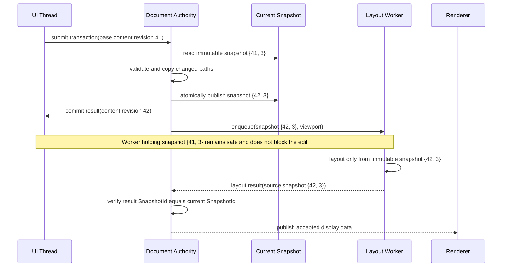
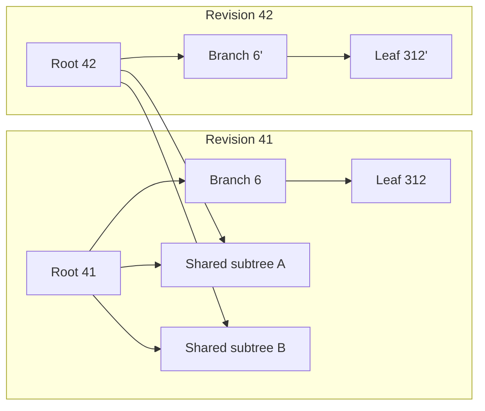
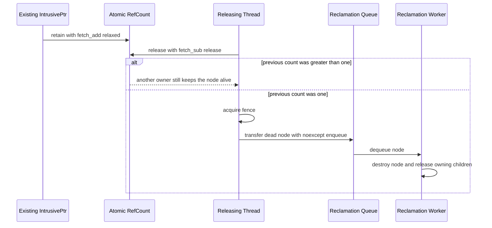
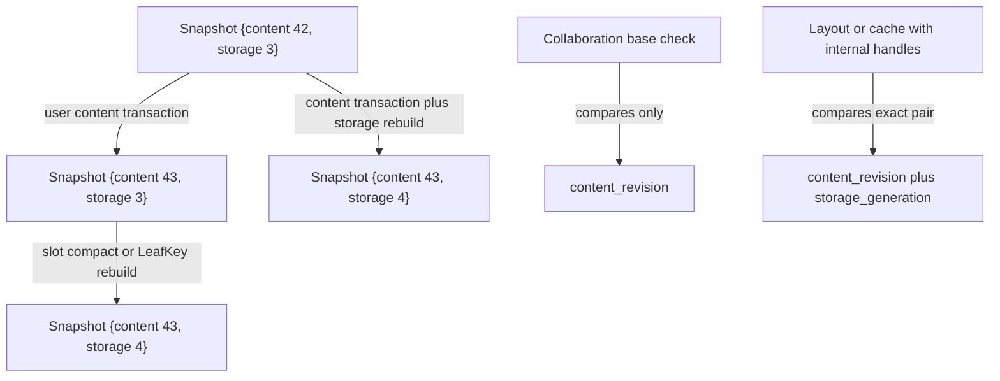

# Layout revision snapshot：交易與背景排版資料流

## 範圍

- 回答一次交易如何建立新 revision，而不複製整份長文件。
- 顯示 UI、authority、不可變 snapshot 與背景 layout worker 的交接。
- 本圖不決定 leaf／Record page 容量、page-table fanout 或 reclamation queue 的實作容器。

## 資料流



## Copy-on-write 範例

假設使用者要在 revision 41 的第 50,000 個位置插入新 Block，而該位置位於 `Leaf 312`：



插入交易只建立 `Leaf 312'`、`Branch 6'` 與 `Root 42`。其他 subtree 仍由兩個 revision 共用；因此成本
取決於樹高與被改動的 leaf 數量，而不是整份文件的 Block 數量。若 leaf 因插入而超出容量，該次
交易才會額外 split leaf，並沿路更新新的 ancestor。

若交易只修改 Paragraph 內的文字，Block 順序沒有改變，因此 FlowSequence root 可以直接沿用；該次
交易只需建立新的 Block record view，並讓對應的 layout cache 失效。內容版本與順序 root 仍一起由
同一個 `DocumentRevision` 發布。

## 一致性界線

Snapshot 必須同時固定：

- ObjectStore 中 Block 的內容版本。
- 每個 FlowContainer 的 FlowSequence root。
- transaction 產生的同一個 `SnapshotId`。

只固定 FlowSequence root 並不足夠。若 worker 仍從 live ObjectStore 讀 Block，可能取得 revision 41
的順序與 revision 42 的文字，形成無法重現的混合排版。

## 失效結果

P1 採 exact-SnapshotId 規則：layout result 的來源 SnapshotId 不是目前 SnapshotId 時，authority 丟棄整份
結果。這會浪費少量背景工作，但規則可直接驗證。部分結果沿用必須等 dependency key 被正式定義後
才能加入，不能由 client 猜測。

## Snapshot 回收

P1 由 intrusive atomic reference count 保證 immutable root 與共享 subtree 的生命週期。讀者只要
持有 `IntrusivePtr<const SnapshotRoot>`，走訪期間的節點就不能被回收。最後一個引用釋放時，實際
銷毀工作移交背景 reclamation queue，避免大型 subtree 的遞迴釋放占用 UI 執行緒。P1 不使用 epoch
reclamation，也不允許從未保護 raw pointer 建立新 owner。

## Intrusive reference count 生命週期



### 具體例子：UI 放開最後一個 root

假設 UI 與 layout worker 各持有 revision 41 root，計數是 2。UI 先放開後變成 1，不做銷毀；worker
完成後把 1 減成 0，執行 acquire fence 並把 node 交給 reclamation queue。Destructor 只在 reclaimer
執行，且 child 的最後釋放也回到相同 queue，避免 UI 遞迴銷毀深 DAG。

不得執行以下流程：

```text
raw Node* 暫存於全域
原 owner release 到 0
另一執行緒再對 raw pointer retain
```

此時記憶體可能已排入回收，屬 use-after-free／resurrection。P1 所有 retain 都必須源自仍有效的
`IntrusivePtr`。

## ObjectStore snapshot


一般內容修改只建立新版 record、複製一個 RecordPage 與 page-table 的短路徑。刪除留下 tombstone，
不立即重用 slot。Compact 若改變 slot 映射，會建立新的 directory generation；舊 snapshot 持有舊
generation，因此不會在背景讀取期間被換掉映射。

## SnapshotId 的兩個軸



`content_revision` 表示使用者可觀察的內容與 ownership 先後；`storage_generation` 表示 slot、LeafKey
或其他內部 locator 的配置世代。兩者一起構成 `SnapshotId`。

### 具體例子：compact 不製造協作衝突

使用者 A 以 content revision 43 開始輸入。同時背景 compact 把 snapshot `{43, 3}` 換成 `{43, 4}`：

- A 的交易仍以 content revision 43 驗證，不因純 storage maintenance 被拒絕。
- 持有 `{43, 3}` LeafKey／ObjectSlot cache 的 layout result 不能套到 `{43, 4}`。
- 只保存 stable BlockId 的 selection 不因 storage generation 改變而換 anchor。

## 偏離原建議後的驗證責任

本設計沒有採用原先建議的 `std::shared_ptr<const Node>`，而直接使用 intrusive counter。這提高配置
控制能力，但也把 retain／release 配對、memory ordering 與 borrowed pointer lifetime 變成專案自身
必須證明的正確性。強制測試與人工審查閘門記錄於 `LAY-0002` D17 與 `tasks/roadmap.md` P1。

## 術語

| 名詞 | 具體意義 |
|---|---|
| Snapshot | 對 ObjectStore、FlowSequence roots 與索引的一致不可變讀取視角 |
| SnapshotId | `{content_revision, storage_generation}` 組成的 snapshot 身分 |
| Content revision | 使用者可觀察內容或 ownership 每次成功交易後增加的序號 |
| Storage generation | Compact 或內部 locator 重建後增加的儲存配置世代 |
| Persistent data structure | 修改後保留舊版本，且新舊版本能共用未改節點的資料結構 |
| Intrusive reference count | 計數器直接位於被管理物件內，由自訂 owning pointer 操作 |
| Atomic reference count | 以原子操作讓跨執行緒 retain／release 不發生 data race |
| Memory order | 原子操作對其他記憶體讀寫建立的排序契約；此處 retain 用 relaxed，最後 release 配 release＋acquire fence |
| Owning reference | 保證物件生命週期的 `IntrusivePtr<const T>` |
| Borrowed pointer | 不增加計數，只能在 owning root 保活範圍內使用的 `const T*` |
| Resurrection | 計數已到零後又試圖從 raw pointer 建立 owner；本設計禁止 |
| Reclamation queue | 接收最後釋放的 node，交由背景執行緒實際銷毀的佇列 |
| DAG | Directed acyclic graph；共享 subtree 可以有多個父 owner，但 owning edge 不得成環 |
| Exact-match | 工作來源 SnapshotId 必須與目前完整相等才接受結果的保守規則 |

## 依據

- `spec/decisions/02-layout/LAY-0002-invalidation-offset-and-viewport-index.md` 的 D4、D8–D10、D17–D18。
- `spec/decisions/01-document/DOC-0001-object-tree-stable-id-reference-and-composition.md` 的 authority
  revision 與 stable-ID 決策。
- FlowSequence 定位、LeafKey、TreeCursor 與重平衡另見
  `docs/architecture/flow-sequence-location-and-traversal.md`。

## 尚未表達

- Record page 容量、page-table fanout 與 compact 門檻。
- 過期 layout result 的細粒度重用。
- Reclamation queue 的 bounded／unbounded 結構、背壓與 shutdown 實作。
