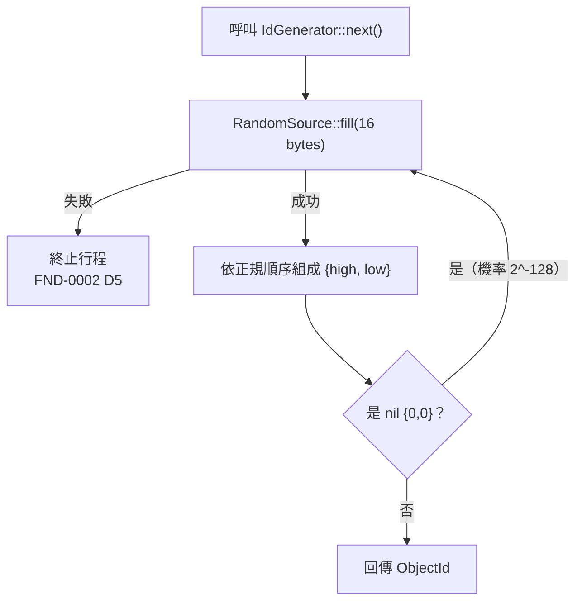
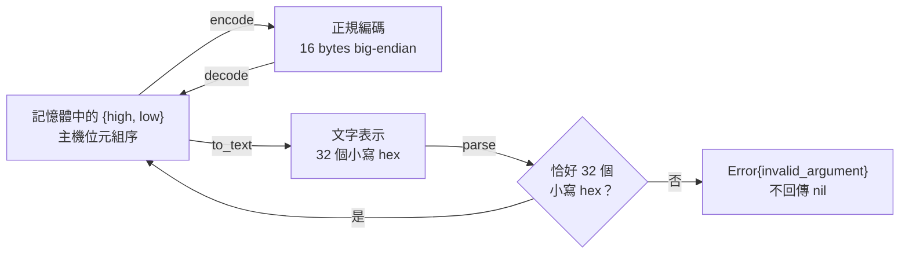
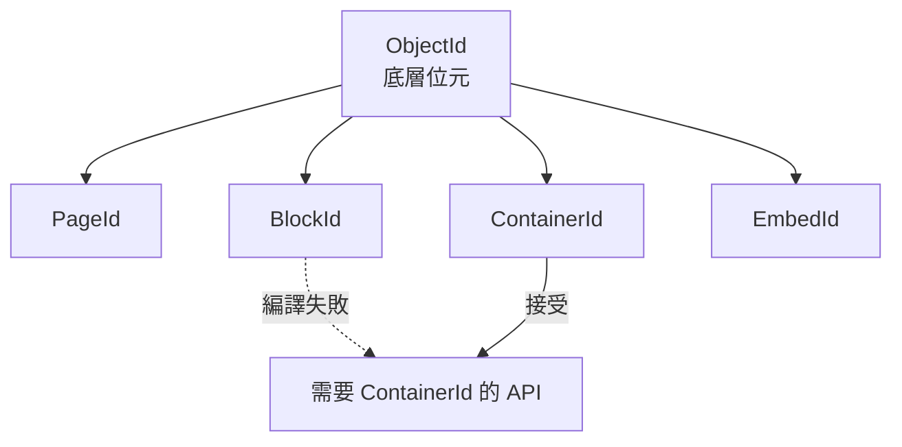

# ObjectId 的生成、編碼與拒絕路徑

聚焦問題：**一個 128-bit 身分如何產生、如何跨越儲存邊界、以及在哪些點被拒絕。**

決策依據：[`DOC-0002`](../../spec/decisions/01-document/DOC-0002-object-id-representation-and-generation.md)、
[`DOC-0001` D6](../../spec/decisions/01-document/DOC-0001-object-tree-stable-id-reference-and-composition.md)。

## 術語表

| 名詞 | 定義 |
|---|---|
| `ObjectId` | `{high: uint64, low: uint64}`，比較採 `{high, low}` 無號字典序 |
| **nil id** | `{0, 0}`。表示「沒有物件」，生成器永不產生 |
| **正規編碼** | 16 位元組，`high` 的 8 位元組在前，各自 big-endian |
| `RandomSource` | 平台亂數來源介面，輸出純位元組，不洩漏平台 handle |
| `IdGenerator` | 產生 ObjectId 的介面；可替換，測試使用確定性實作 |

## 生成路徑



**節點責任**：`RandomSource` 只負責填位元組，不知道 ObjectId 的存在；
`IdGenerator` 負責組裝與 nil 重試，不知道亂數怎麼來的。

**箭頭含義**：實線為正常控制流。`Fill → Abort` 是失敗路徑——
身分無法生成時繼續執行只會產出損壞的文件，因此依 `FND-0002` D5 終止而非回報錯誤。

**失敗時的結果**：行程終止，沒有半成品文件被寫出。nil 重試在實務上永不發生
（`2^-128`），存在的意義是讓「nil 代表無物件」成為可證明的 invariant 而非慣例。

## 跨邊界的編碼與拒絕



**節點責任**：`Mem` 是唯一可運算的形式；`Bytes` 是儲存與跨 C ABI 的形式；
`Text` 是人可讀與設定檔的形式。三者是同一個值的三種投影，不是三份資料。

**箭頭含義**：四個轉換兩兩互逆，這是 round-trip property test 的直接對象。

**失敗時的結果**：解析失敗回傳 `Error`，**不回傳 nil**。
若以 nil 表示失敗，「這個欄位沒有物件」與「這個欄位的輸入損壞」會變得無法區分——
那是典型的靜默錯誤，會在資料損壞很久之後才顯現。

## 具體資料例子

```text
high = 0x0123456789ABCDEF
low  = 0xFEDCBA9876543210

正規編碼 = 01 23 45 67 89 AB CD EF FE DC BA 98 76 54 32 10
文字     = "0123456789abcdeffedcba9876543210"
nil 文字 = "00000000000000000000000000000000"
```

位元組傾印與十六進位字串**逐字對應**，這是選 big-endian 的用途：
除錯時不需要在腦中翻轉位元組。

被拒絕的輸入：

```text
"0123456789ABCDEFFEDCBA9876543210"      大寫
"01234567-89ab-cdef-fedc-ba9876543210"  含分隔符
"0x0123456789abcdeffedcba9876543210"    含前綴
"0123456789abcdeffedcba987654321"       長度 31
```

**為何不接受大寫與破折號**：ObjectId 不是 UUID（沒有 version 與 variant 位元）。
接受 UUID 外觀會讓讀者與工具誤套 RFC 4122 的假設，而那個誤解會被沿用很久。
單一嚴格格式使「這不是 UUID」在肉眼層級即可辨識。

## 強型別包裝的作用點



**節點責任**：四種 ID 的底層位元與 nil 語意完全相同，型別只存在於編譯期。

**箭頭含義**：虛線是**被編譯器阻擋**的路徑。把 `BlockId` 誤傳成 `ContainerId`
會導致查找失敗或查到別的物件，兩者都沒有徵兆——因此在編譯期攔截，
而不是在執行期斷言。

**失敗時的結果**：編譯錯誤。轉換必須經由具名函式明確表達，且該函式在人工審查清單上。
