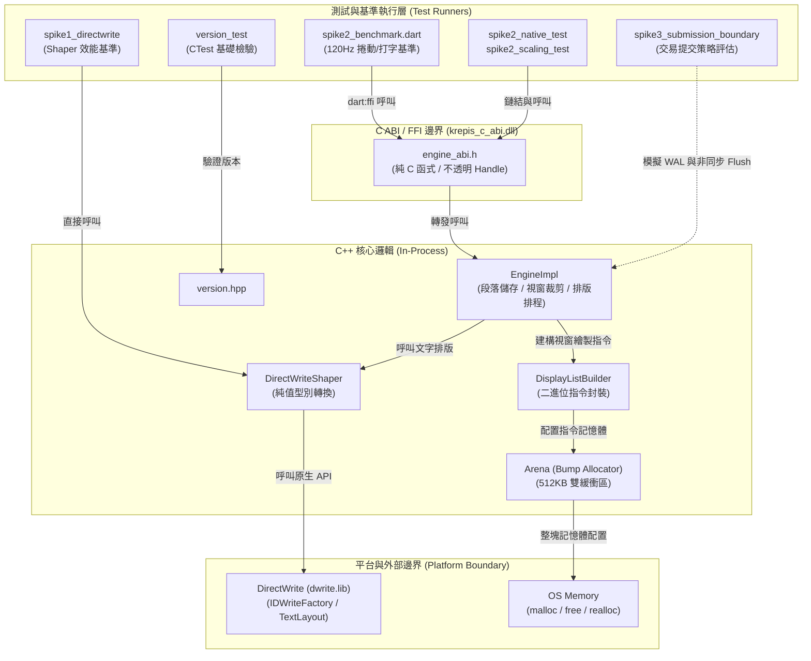
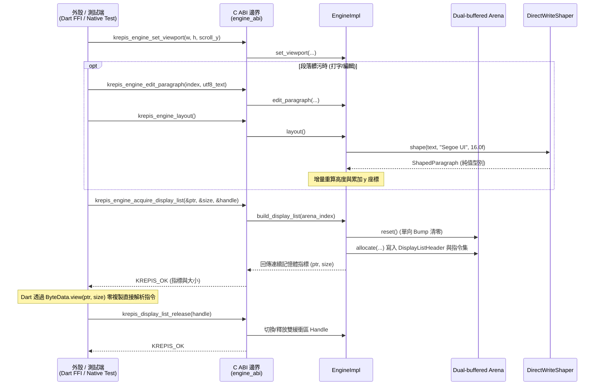

# P0 測試架構：模組依賴與驗證邊界

## 範圍

- 核心問題：本專案在 P0 階段如何透過 Spike 測試集與單元測試驗證文字 Shaping、FFI 零複製 Display List 延遲與交易提交邊界？
- 納入：P0 三大 Spike 測試執行器（Dart Benchmark、Native/Scaling Test、DirectWrite 測試、Authority 模擬）、CTest 基礎測試、C ABI 邊界、C++ 核心排版與 Arena 記憶體管理、底層 DirectWrite 與 OS 邊界。
- 不納入：未進入實作的 P1 完整 Node Tree、Selection、Undo/Redo、Flutter 完整視圖與實際跨行程 Authority IPC 實作。

## 架構圖

### 主要視角：模組依賴與驗證架構

### 輔助視角：Spike 2 Display List 零複製互動時序

## 證據

- [`tests/CMakeLists.txt`](file:///c:/Projects/Krepis/tests/CMakeLists.txt#L1-L12) 與 [`tests/version_test.cpp`](file:///c:/Projects/Krepis/tests/version_test.cpp#L1-L29)：定義 CTest 測試執行檔 `krepis_tests` 與 `version.hpp` 驗證。
- [`spikes/CMakeLists.txt`](file:///c:/Projects/Krepis/spikes/CMakeLists.txt#L1-L87)：定義 Spike 1 (`spike1_directwrite`)、Spike 2 C ABI 共享庫 (`krepis_c_abi`)、C++ 原生測試 (`spike2_native_test`)、規模擴展測試 (`spike2_scaling_test`) 與 Spike 3 交易評估 (`spike3_submission_boundary`)。
- [`spikes/spike1_directwrite/spike1_shaper.hpp`](file:///c:/Projects/Krepis/spikes/spike1_directwrite/spike1_shaper.hpp#L11-L65)：定義 `GlyphInfo`、`ShapedRun`、`ShapedParagraph` 純值型別與 `DirectWriteShaper` 抽象介面。
- [`spikes/spike2_ffi_displaylist/engine_abi.h`](file:///c:/Projects/Krepis/spikes/spike2_ffi_displaylist/engine_abi.h#L16-L84)：定義 C ABI 介面（含 `krepis_engine_acquire_display_list`、`krepis_display_list_release`、Opaque Handle）。
- [`spikes/spike2_ffi_displaylist/display_list.hpp`](file:///c:/Projects/Krepis/spikes/spike2_ffi_displaylist/display_list.hpp#L12-L191)：定義二進位指令結構體（`DrawRectCommand`、`DrawGlyphRunHeader`、`DisplayListHeader`）以及 512KB Bump Allocator `Arena` 與 `DisplayListBuilder`。
- [`spikes/spike2_ffi_displaylist/engine_abi.cpp`](file:///c:/Projects/Krepis/spikes/spike2_ffi_displaylist/engine_abi.cpp#L21-L135)：`EngineImpl` 整合 `DirectWriteShaper`、雙 `Arena`、視窗裁剪過濾以及版面計算邏輯。
- [`spikes/spike2_ffi_displaylist/spike2_benchmark.dart`](file:///c:/Projects/Krepis/spikes/spike2_ffi_displaylist/spike2_benchmark.dart#L1-L311)：Dart 端透過 `dart:ffi` 呼叫 C ABI，並使用 `ByteData.view` 零複製解析 Display List 驗證 120Hz 捲動與打字延遲。
- [`spikes/spike2_ffi_displaylist/spike2_scaling_test.cpp`](file:///c:/Projects/Krepis/spikes/spike2_ffi_displaylist/spike2_scaling_test.cpp#L27-L80)：對 $N \in [10^3, 10^6]$ 段落進行極限規模壓測，揭露 $O(N)$ 座標累加缺口。
- [`spikes/spike3_submission_boundary/spike3_main.cpp`](file:///c:/Projects/Krepis/spikes/spike3_submission_boundary/spike3_main.cpp#L24-L115)：評估 Per-keystroke、300ms Debounce、以及 In-Process Lock-free WAL + 異步背景批次 Flush（策略 C）之延遲與資料安全視窗。
- [`tasks/p0-spike-report.md`](file:///c:/Projects/Krepis/tasks/p0-spike-report.md#L1-L158)：彙整三大 Spike 實測數據、生死門檻判定與事後複驗更正記錄。

## 閱讀說明

1. **零複製生命週期保證**：`Arena` 採 Bump Allocator 設計，在 `krepis_engine_acquire_display_list` 到 `krepis_display_list_release` 期間提供保證有效的連續二進位緩衝區，使 Dart 端能在不觸發 GC 與記憶體複製的前提下完成 120Hz 渲染。
2. **值型別隔離**：`DirectWriteShaper` 將 Windows 原生 COM 物件（`IDWriteFactory`、`IDWriteTextLayout`）封裝於實作內部，回傳純值型別 `ShapedParagraph`，確保核心資料結構不依賴特定 OS API Handle。
3. **已知設計缺口標記**：`spike2_scaling_test` 實測發現 `EngineImpl::layout()` 在 $N=10^6$ 時的 y 座標累加為 $O(N)$，已記錄於架構報告並作為 P1 垂直切片的重點改造項目（改用前綴和或延遲物化）。
