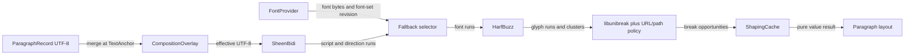

# 文字 shaping：資料流架構

## 範圍

- 核心問題：權威 Paragraph 與 session-local composition 如何變成可排版 glyph run。
- 納入：`ParagraphRecord`、`CompositionOverlay`、`FontProvider`、文字處理堆疊與 cache。
- 不納入：行盒排列、display list opcode 與平台字型列舉內部。

## 架構圖

## 證據

- `spec/decisions/03-text/TXT-0001-text-shaping-fallback-composition-and-cache.md`：authority、輸出與 cache 契約。
- `tasks/spike5-text-shaping-report.md`：HarfBuzz shaping 與缺字行為。
- `tasks/spike6-line-breaking-report.md`：UAX #14 與 URL 候選斷點。
- `tasks/spike7-bidi-report.md`：SheenBidi run 分析。

## 具體例子

Paragraph 是 `前往 https://例子.test/路徑`，游標後有尚未確定的注音候選字 `頁`：

1. `CompositionOverlay` 只在目前 session 產生 effective text，不修改 ParagraphRecord。
2. SheenBidi 產生方向 run，fallback selector 為漢字挑到具 glyph coverage 的字型。
3. HarfBuzz 回傳 glyph 與 cluster；libunibreak 候選點再由 URL policy 過濾。
4. Cache key 含 overlay revision，因此不能誤用沒有 `頁` 的正式內容結果。

## 閱讀說明

- 箭頭表示資料轉換，不代表 ownership；所有中間結果都是可重建值或 cache。
- `FontProvider` 只提供平台資源，不能決定 fallback 政策。
- 任一階段失敗便不產出部分 glyph run，呼叫端保留上一個有效 display list。

## 術語

| 名詞 | 具體意義 |
|---|---|
| effective text | ParagraphRecord 套用目前 session composition 後，僅供 layout 使用的文字 |
| glyph run | 使用同一字型、script 與方向的一段 glyph 純資料 |
| cluster mapping | glyph 與來源 UTF-8／grapheme 範圍的對應 |
| ShapingCache | 依完整 dependency key 保存純值 shaping 結果的 LRU cache |
