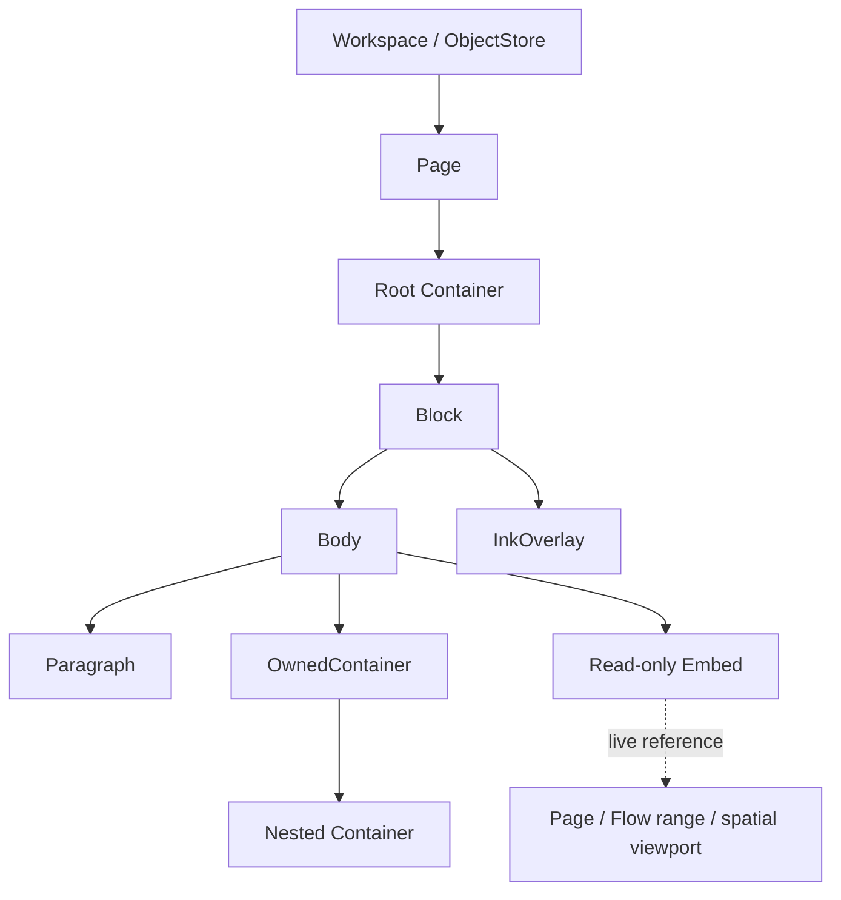

# DOC-0001：物件樹、穩定識別、即時引用與組字疊加層

## 狀態

**Accepted**

## 日期

提出：2026-08-16  
接受：2026-08-16（使用者逐項核准 D1–D17）

## 背景

P1 需要一個同時承載流式與空間布局的最小模型。產品需求不是把同一內容節點無條件投影成
兩種布局，而是讓每個頁面或區域有自己的布局，彼此可巢狀組合或唯讀即時引用；流式頁面的
每個 Block 都能覆蓋手寫圖層。

本決策遵守既有約束：client 不能成為權威；流式位置由布局計算，空間位置由父容器保存；
composing region 必須參與布局但不得持久化或進入 undo；自由筆跡不混入文字內容。

## 模型總覽



| 關係 | 職責 | 規則 |
|---|---|---|
| ObjectStore | 物件身分與內容 | 以 `ObjectId` 查找，不表達文件順序 |
| Ownership tree | 物件真正屬於哪裡 | 必須無環；每個被擁有物件至多一個 owner |
| Sequence／placement | 同一容器內如何排列 | Flow 保存順序；Spatial 保存位置與尺寸 |
| Reference graph | 其他位置如何顯示內容 | 允許循環；讀取時從起點截斷循環 |

## D1：Ownership 骨架是 `Page → Container → Block`

Page 只保存 root container。只有 Container 能擁有並排列 Block：

```text
PageRecord { id, root_container_id }
FlowContainer { children: Sequence<BlockId> }
SpatialContainer { children: Sequence<Placement> }
Placement { child_id, rect }
```

Block 是可組合的畫面單位：

```text
BlockRecord { id, body, ink_layer }
```

第一版 body 至少有 `ParagraphBody`、`OwnedContainerBody` 與 `EmbedBody`。FlowContainer 與
SpatialContainer 都是 ObjectStore 中有 stable ID 的一級物件。產品頁面類型由 root container
與巢狀容器組合，不在核心建立封閉的頁面類型枚舉。

每個 Block 在語意上都支援 InkOverlay；沒有筆跡時可延遲配置實體 InkLayer。

## D2：物件池不表達文件順序

Workspace 使用統一 ObjectStore：

```text
ObjectStore { ObjectId -> ObjectRecord }
LocationIndex { child_id -> { owner_container_id, sequence_handle } }
```

ObjectStore 的 map、hash table 或 arena 實體順序沒有文件語意。Flow 順序只存在於 Container 的
child sequence；Spatial 布局只存在於 placement。`posIndex` 是從順序結構查出的衍生值，
不是每次插入後重寫所有後方物件的權威欄位。

## D3：內容只有一個 owner，跨位置重用一律使用即時引用

- 來源改變後，所有引用顯示最新內容。
- 引用是唯讀預覽，不接收輸入、IME、selection 或拖曳；點擊可前往來源編輯。
- 刪除 Embed 不刪除來源；刪除來源後回報明確解析狀態，不保存第二份內容。
- P1 不處理跨引用 focus、selection 或 IME。
- OwnedContainer 與 Embed 是不同 body variant，不能共用 ownership 語意。

## D4：流式區間由兩個 Block ID 錨定

```text
FlowRangeEmbed {
    source_flow_id: FlowContainerId,
    anchor_a: BlockId,
    anchor_b: BlockId
}
```

兩個 anchor 是無方向端點；解析時依 `source_flow_id` 的目前順序決定 leading／trailing，
順序反轉不修改引用資料，也不產生 undo。

- 範圍包含兩個端點；相同端點只渲染該 Block。
- 端點之間新增或刪除 Block，範圍依目前結構自然更新。
- 端點刪除時，只能向刪除前的原區間內尋找第一個存活 Block。
- 原區間全部刪除時成為 `empty`，不向區間外尋找，也不降級成頁面開頭。
- 端點修正與刪除屬於同一筆原子 transaction；undo 一起恢復。
- 兩個 anchor 必須直接屬於同一 `source_flow_id`；只檢查同一 Page 不足以建立線性順序。

空間局部引用使用來源 Container 與 viewport：

```text
SpatialViewportEmbed { source_spatial_id, viewport: Rect }
```

## D5：引用可循環，讀取結果不得循環

儲存層允許循環 reference。核心從指定起點解析時，只檢查目前 active path：

- 目標已在目前路徑時產生 `cycle_cut`，保留可點擊的終止框但不再展開。
- 同一目標出現在不同分支不是循環，必須在每個位置正常顯示。
- client 只決定終止框樣式，不自行判斷或重新展開。
- 解析出的無環 view 依起點與 revision 產生，不存回 ObjectStore。

解析狀態至少區分 `resolved`、`empty`、`cycle_cut`、`missing_target` 與 `detached`。

## D6：ObjectId 是 Workspace 全域唯一的永久身分

所有可引用物件共用 Workspace 全域 namespace；C++ 以 `PageId`、`ContainerId`、`BlockId`、
`EmbedId` 等強型別包裝同一種底層 ID。

```text
ObjectId = 128-bit random opaque value
```

- ID 由 Krepis 核心生成；生成器可替換，測試可使用固定序列。
- ID 不含 owner、位置、物件種類或可依賴的建立順序。
- 載入時保留原 ID；匯入碰撞必須拒絕，不靜默改 ID。
- 刪除後永不分配給其他物件；undo 復原時恢復原 ID。
- detached 物件仍占用原 ID。
- C ABI 表示、byte order 與文字格式由 `BND-*` 決定。

## D7：移動保留 ID，複製建立新 ID

- rename、內容變更、同頁移動與跨頁移動都保留 ID。
- 直接引用跟著跨頁移動後的物件。
- FlowRangeEmbed 不跨 Container 追蹤端點；端點移出來源 FlowContainer 時依 D4 向內收縮。
- 複製物件一律建立新 ID。

跨頁移動只修改 ownership sequence 與 LocationIndex，不修改 ObjectStore 中的身分。

## D8：Paragraph 拆分與合併的身分規則

- 開頭按 Enter：在前方新增空 Block，原 Block 與 ID 不變。
- 結尾按 Enter：在後方新增空 Block，原 Block 與 ID 不變。
- 中間按 Enter：前半留在原 Block 並保留 ID；後半移入具有新 ID 的 Block。
- 合併時目的 Block 保留 ID，被併入的 Block ID 消失。

直接引用被移除 Block 時成為 `missing_target`，不得自動改指向合併目的 Block；區間引用依 D4
收縮。

## D9：剪貼情境決定保留哪個 ID

| 操作 | 身分結果 |
|---|---|
| Cut 完整 Block，貼到 Block 之間 | 結構移動，保留來源 ID |
| Cut 完整 Block，貼到真正空 Block | 來源取代空 Block；保留來源 ID，移除空 Block ID |
| 貼到含任何字元的 Block 內 | 文字貼上；保留目標 ID，來源 Block ID 消失 |
| Copy 完整 Block | 新複本取得新 ID |
| Cut 後第一次成功貼上 | move |
| 同一份剪貼內容再次貼上 | copy，取得新 ID |
| Cut 部分文字 | 文字編輯，不攜帶 Block ID |

只有長度為零的 Paragraph 是真正空 Block；只含空白字元的 Paragraph 仍是文字編輯情境。
完整 Block 被 cut 而尚未貼上時可處於 detached；若原 ID 已重新存在，貼上不得建立第二個
同 ID 物件。

## D10：Composing region 屬於核心 EditingSession

Paragraph 只保存 committed text。組字狀態不進 ObjectStore，而由核心的暫態 EditingSession
保存：

```text
EditingSession {
    composition: {
        target_block_id,
        replace_range,
        provisional_text,
        selection_in_composition
    }
}
```

核心 layout 合成 committed text 與 session composition，使暫定文字參與 shaping、換行與游標
計算，但不改寫 Paragraph。

- 外殼送出 `begin`／`update`／`commit`／`cancel` command，不保存第二份規則。
- commit 以一筆原子 transaction 寫入正式文字、清除 composition，並建立一個 undo 單位。
- cancel 只清除 composition，不修改 Paragraph，也不建立 undo。
- session 結束時 composition 必須清除。
- composition 不持久化、不取得 stable ID，也不進入正式文件狀態。
- 未提交的 composition 只出現在該 EditingSession 的主編輯視圖；其他唯讀 Embed 繼續顯示
  committed text，直到 commit 完成後才在同一幀更新。

## D11：Composition anchor 隨正式交易轉換

Composition 不綁定舊 revision 的固定數字 offset，而是綁定目標 Block 中可隨 transaction
轉換的邏輯游標位置。其他 actor 提交正式文字或結構交易時，核心更新 committed document，
同時轉換目前 session 的 composition anchor；未提交文字仍只由該 session 看見。

- 其他 actor 在同一文件或目標 Block 輸入、刪除或合併內容時，不因 revision 改變而取消
  composition。
- 目標 Block 同頁或跨頁移動時，composition 依 stable BlockId 保持輸入中狀態。
- 合併後若目標 Block ID 仍是存活的目的 Block，composition anchor 隨交易轉換。
- 目標 Block 被刪除，或因合併成為身分消失的一方時，取消 composition。
- 使用者可明確取消或提交 composition；提交時將暫定文字插入轉換後的邏輯編輯位置。
- 每筆可能影響目標位置的正式 transaction 都必須產生可供核心轉換 anchor 的結果；client
  不得自行維護第二份游標轉換規則。

邏輯文字 anchor 的正式表示，以及刪除涵蓋 anchor 時的 transformation 尚未決定。

## D12：Composition 使用多區段屬性，不使用兩個全域階段

同一段 composition 可以同時包含未轉換輸入、已轉換文字、目前候選區段與其他平台提供的
顯示狀態，因此核心不把整段 composition 簡化成「注音中／中文待確認」二選一。

```text
CompositionState {
    target_block_id,
    anchor,
    provisional_text,
    selection,
    segments: Sequence<CompositionSegment>
}

CompositionSegment {
    range,
    attribute
}
```

所有 segment 共享同一份文件語意：保持暫定、不持久化、不進 undo、不顯示於唯讀 Embed，
並依 D11 隨正式 transaction 轉換 anchor。Segment attribute 只影響顯示與平台 IME 事件處理，
不得使部分 composition 提前成為 committed text。

核心不從 provisional text 的字元內容猜測轉換階段，也不把實體 Esc／Enter 固定解讀成取消／提交。
平台 IME 先處理按鍵，外殼再把明確的 update、commit 或 cancel 結果送入核心。

平台屬性如何映射為跨平台的 `CompositionSegment.attribute` 留給 `TXT-*`／`BND-*` 決定。

參考：

- [Microsoft：Composition String](https://learn.microsoft.com/en-us/windows/win32/intl/composition-string)
- [Microsoft：TSF Compositions](https://learn.microsoft.com/en-us/windows/win32/tsf/compositions)
- [Microsoft：Providing Display Attributes](https://learn.microsoft.com/en-us/windows/win32/tsf/providing-display-attributes)

## D13：線上協作由 Authority 排定交易順序

P1 與目前可預見的線上協作採單一 Authority 排序模型，不因尚未定義的離線合併需求提前導入
sequence CRDT。

- 每筆正式 transaction 帶有其建立時的 base revision。
- Authority 為已接受 transaction 建立唯一順序與新 revision。
- 本地尚未提交的 composition、selection 與其他 session anchor，依序通過已接受 transaction
  的 transformation 結果更新。
- client 不自行決定並發文字的最終順序，也不保存第二份 transformation 規則。
- 遠端游標、選取與拖動中的半透明預覽屬於暫態 presence，不進 ObjectStore；放開後才提交
  正式 move transaction。

離線多寫入者產生分支後如何重連合併不包含在本次決策內。未來可以評估 revision DAG、
三方結構合併與顯式衝突，但目前不承諾 Git 式合併或 CRDT。

## D14：Active composition 留在同位置新插入內容之前

A 已在相同邊界顯示 provisional composition 時，Authority 接受其他 actor 對該邊界的純插入，
composition anchor 不越過新內容。A 最後 commit 時，暫定內容排在該批新插入內容之前。

```text
共同基底：AB|CD
A 暫定輸入：AB[X]CD
B 正式插入 Y：AB[X]YCD
A commit 後：ABXYCD
```

若多筆同位置純插入先後被 Authority 接受，它們依 Authority 順序排在 composition 之後。
這條規則只決定 active composition 對同位置 pure insert 的 transformation；一般 selection 的
affinity 由 `EDT-*` 另外決定。

修訂紀錄：本題最初曾選擇讓 composition 越過新插入內容；使用者在檢查 `ABXCD`／`ABYCD`
合併結果後，於同日改為本決策，以避免產生 `ABYXCD`。

## D15：刪除與替換涵蓋 Composition anchor 時收縮到接合邊界

其他 actor 的刪除或替換涵蓋 composition anchor，但目標 Block 身分仍存在時，不取消
composition：

- 刪除完全位於 anchor 前方：anchor 依刪除結果向前移。
- 刪除完全位於 anchor 後方：anchor 不變。
- 刪除範圍涵蓋 anchor：anchor 收縮到刪除後的接合邊界。
- 替換範圍涵蓋 anchor：anchor 收縮到接合邊界後，位於該筆 replacement content 之後。
- 刪除全部文字但保留空 Block：composition 保留在空 Block 的起點。
- 刪除 Block 物件本身：依 D11 取消 composition。

```text
原始：ABCD[composition]EF
刪除 BCD：A[composition]EF
以 Y 取代 BCD：AY[composition]EF
```

D14 處理「在同一邊界純插入」；本決策處理「被取代 range 本身涵蓋 anchor」。兩者是不同的
transaction transformation，不以 delete 加 insert 的實作細節混為同一條規則。

## D16：核心文字位置使用 Grapheme cluster boundary

核心對 committed text 的游標、selection 與 composition 接合點，統一以使用者可感知的
grapheme cluster boundary 表達：

```text
TextAnchor {
    block_id,
    base_revision,
    grapheme_boundary,
    affinity
}
```

- `grapheme_boundary` 只對 `base_revision` 有效，通過 transaction 後必須轉換到新 revision。
- 游標、選取端點與刪除操作不得停在 grapheme cluster 內部。
- UTF-16 code-unit offset 只用於 Windows IME／TSF 等平台邊界，再經 cluster mapping 轉換。
- UTF-8 byte offset 只用於字串儲存與內部索引，不具有使用者編輯語意。
- Provisional composition 內的 segment range 可以保留平台需要的 offset，但它與 committed
  document 的接合點必須落在 grapheme boundary。

Grapheme segmentation 由 ICU、平台 API 或自有實作提供，屬於 `TXT-*` 後續選型；本決策只固定
核心公開語意與轉換邊界。

## D17：Composition 不跟隨被拆分或剪走的文字片段

Composition 黏著正在編輯的 Block 身分與該 Block 內的邏輯邊界，不黏著被其他 actor 移出的
committed text。其他 session 看不到 provisional composition，其拆分與剪貼 transaction 也不得
攜帶該 composition。

- Split 位於 anchor 後方：composition 保持原位置。
- Split 位於 anchor 前方或正好位於 anchor：composition 留在原 Block，收縮到其末端邊界。
- Cut 部分文字並貼到其他位置：composition 不跟著被移動的文字，依 D15 留在原 Block 的最近
  有效邊界。
- 原 Block 成為空 Block但 stable ID 仍存在：composition 留在該空 Block。
- 整個 Block 搬移且 stable ID 保留：composition 依 D11 跟著同一 Block 移動。
- 原 Block 物件被刪除或其 ID 因合併消失：取消 composition。

```text
原始：Block 123 = ABCD[composition]EF
B 在 AB|CD 拆分：
    Block 123 = AB[composition]
    Block 456 = CDEF
```

這條規則使遠端 transaction 只影響已到達 Authority 的 committed content，不會因本地不可見
overlay 的位置而改變其剪貼結果。

## 被淘汰的方案

| 方案 | 理由 |
|---|---|
| 同一內容永久維護流式與空間雙投影 | 需求是容器組合與引用；雙投影提前引入 selection、刪除與 undo 歧義 |
| 把 Flow／Spatial 位置放進 Block | 內容節點會依賴布局種類，新增布局時必須修改所有 Block |
| Page 保存扁平 `map<Id, posIndex>` | 無法表達巢狀容器，且前方插入會使後方 index 發生 `O(n)` 更新 |
| Page-local BlockId | 跨頁移動會改變完整身分，破壞直接引用 |
| Embed 取得來源 ownership | 刪除引用可能誤刪來源，無法多處引用同一內容 |
| 禁止 reference 循環 | 雙向引用本身有效；只需保證讀取與渲染終止 |
| 空區間改渲染頁面開頭 | 靜默改變引用語意，可能顯示未選擇的內容 |
| 把 composing text 寫入 Paragraph | 容易污染持久化、undo 與正式狀態 |

## 後果

### 正面

- Flow 與 Spatial 是可組合能力，不需在核心持續增加產品頁面類型。
- ObjectStore、ownership、順序與引用各有單一責任。
- stable ID 支援跨頁移動、即時引用、反向引用索引與可預測的 undo。
- 組字內容能影響布局，又不污染正式文件狀態。

### 負面

- 核心必須維護 ObjectIndex、LocationIndex 與反向引用索引的一致性。
- 刪除或移動端點會觸發相關區間引用的同 transaction 修正。
- 每一條 reference traversal 都必須經過核心的 active-path resolver。
- Cut 的 detached 生命週期、undo 與再次貼上需要明確狀態機。

## 尚未決定

- TextAnchor 的具體儲存型別，以及尚未列舉的 transaction transformation。
- 離線多寫入者的 revision DAG、結構合併、衝突表示與重新連線策略。
- Ink 超出 Block 邊界時是否裁切，以及文字 reflow 後如何處理筆跡。
- ObjectId 的隨機來源、序列化 byte order 與文字表示。
- ownership subtree 刪除、tombstone 與垃圾回收策略。

## 相關決策

- **本決策依賴**：[`FND-0001`](../00-foundation/FND-0001-scope-language-boundary-and-rejections.md)、
  [`FND-0002`](../00-foundation/FND-0002-c-abi-error-memory-and-threading.md)。
- **依賴本決策**：[`LAY-0002`](../02-layout/LAY-0002-invalidation-offset-and-viewport-index.md)、
  `EDT-*`、`TXT-*`、`INK-*`、`BND-*`。
