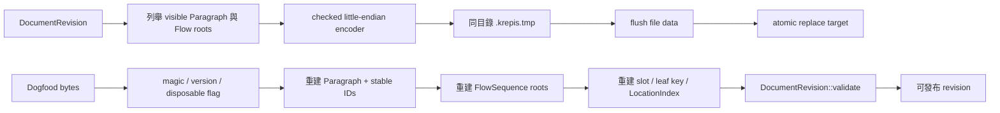

# DOC-0003：可丟棄的 Dogfood 檔案格式

## 狀態

**Accepted（Q1=A，2026-08-21）**

## 生命週期警告

這不是正式 schema，也不是 authority protocol。它只讓 Notist 在 P1 開始每日使用，**P4 authority
落地時必須整體丟棄**；不得為它新增 migration chain、跨裝置相容承諾或協作語意。

## 保存邊界

| 保存 | 不保存 |
|---|---|
| 可見 `ParagraphRecord` 的 UTF-8 | ObjectSlot、LeafKey、LocationIndex |
| stable `BlockId`、`ContainerId` | layout／shaping cache 與失效資料 |
| 每個 FlowContainer 的 Block 順序 | selection、undo／redo、composition overlay |
| magic、版本與 disposable flag | identity、permission、session、protocol、digest |

P1 dogfood 尚未包含 Ink，所以本格式不保存 `InkStroke` 或 `BrushStyle`，也不得宣稱 Ink 可存檔。
若 Ink 在 P4 正式格式前進入 dogfood，必須同一次擴充同時保存 stroke 與 brush，並提高版本。

## 資料流與重建

存檔先在記憶體完成全部編碼，編碼失敗不接觸既有檔案。成功後在目標同目錄覆寫固定暫存檔、flush，
再以作業系統原子替換；POSIX 另 flush parent directory，Windows 使用
`MoveFileExW(REPLACE_EXISTING | WRITE_THROUGH)`。

P1 暫存格式採單一 writer；固定 `.krepis.tmp` 不提供跨 process 鎖定。若同一路徑可能由兩個程序
同時存檔，必須由未來 authority 仲裁，不能把這個暫時 codec 擴張成隱性 authority。

## Version 1 二進位形狀

所有整數採 little-endian；ObjectId 使用 DOC-0002 的 16-byte 正規 big-endian 編碼。

| 區段 | 欄位 |
|---|---|
| Header | 8-byte `KRPDOG01`、`u16 major=1`、`u16 minor=0`、`u32 disposable=1` |
| Objects | `u64 count`；每筆為 `u32 kind=1`、ObjectId、`u64 byteLength`、UTF-8 bytes |
| Containers | `u64 count`；每筆為 ContainerId、`u64 blockCount`、依序排列的 BlockId |

Reader 必須精確消耗整個檔案。未知 major/minor 回 `version_mismatch`；magic、flag、截斷、尾端資料、
nil／重複 ID、未知 kind、超限長度或 Flow 指向不存在／重複 Block 都 fail closed。上限為一千萬物件、
一百萬容器、單 Paragraph 64 MiB、整檔 1 GiB；encoder 與 decoder 使用同一組上限，避免產生自己
讀不回來的檔案。

## 具體例子

來源有 `Container 07`，順序為 `[Block 20, Block 10]`；兩筆文字分別是 `café`（combining acute）
與 `第一段`。重開後 slot 與 LeafKey 可以不同，但 `BlockId 20/10`、UTF-8 bytes 與順序必須相同。
若檔案在第二個 BlockId 的第 7 byte 截斷，整份載入失敗，不回傳只有第一段的半成品 revision。

## 驗證證據

- round-trip 保存 UTF-8、stable IDs 與 Flow 順序。
- 對合法檔案的每一個截斷位置逐一驗證 fail closed。
- 未知版本、尾端垃圾、重複 Flow ownership 都拒絕。
- 同一路徑連續存 `old`、`new` 後只讀到完整 `new`，且成功後不留下暫存檔。
- WSL GCC 聚焦測試通過；Win32 寫入分支由 MSVC 19.44 `/W4 /permissive-` 編譯通過。
