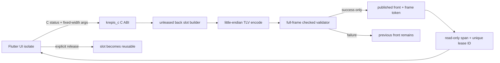

# P1 Display List 與 C ABI 邊界報告

## 狀態

**格式、雙緩衝與最小 C ABI 完成；待文件/layout command 與 Dart FFI 垂直接線。**

## 邊界資料流

## 實作不變條件

- 兩個 slot 各自直接持有一個連續 builder buffer，沒有第三個 retained scratch arena。
- command 直接 bump 到 buffer；不為每個 rect／glyph run 建 heap payload。
- validator 完整接受後才增加 token；截斷、版本、flags、opcode、size、padding、stack 任一錯誤整幀拒絕。
- C header 由真正的 C compiler 建置；opaque handle 之外不暴露 C++ 型別。
- 每個 engine 綁建立執行緒；C ABI catch-all 阻止例外跨界，`bad_alloc` 依 FND-0002 終止。
- engine 有 outstanding lease 時 destroy 回 `invalid_state`；成功 release 後 acquire/release 計數一致。

## 具體例子

Flutter 持有 token 71（slot A），核心可在 slot B 產出 token 72。若 Flutter 也 acquire 72 而未釋放
71，第三次 `begin_frame` 回 `invalid_state`；它不能為了繼續跑而覆寫 A。釋放 71 後 A 才成為 back。
若 token 73 的第二個 command size 宣告超出 span，publish 失敗，下一次 acquire 仍取得完整 token 72。

## 證據

- 6 個 opcode round-trip、每一 byte 截斷、版本矩陣、未知 flags/opcode、溢出 size、非零 padding、
  command count 與兩種 stack 不平衡均有測試。
- 純 C 測試建立 shared-library handle、encode/publish/acquire/validate/release/destroy，並驗證未釋放時
  destroy 拒絕。
- Release BND-5：203 commands/frame、104,096 bytes/frame、p99 65.193 µs、max 160.632 µs；
  acquire=release=4,200。
- Peak→steady：9,600,104 bytes 降至 128 bytes，縮容 1,075.04 µs；8 MiB／25%／每 slot 60 幀
  遲滯門檻正式定案。
