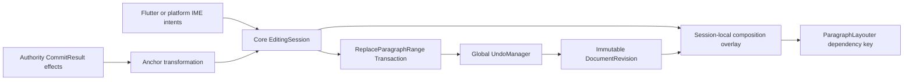

# P1 Flow 編輯、IME、Selection 與 Undo 執行計畫

## 狀態

**核心階段完成（2026-08-21）；Flutter／Notist 接線併入 P1 display list 與 C ABI 階段。**
本計畫不新增人工決策；一般文字 merge 時間窗暫定 `1000 ms`，待 Notist 真實輸入 trace
校正，但不改變 typed merge 契約。

## 資料流



## 型別與不變條件

- `TextAnchor` 保存 `{BlockId, base_content_revision, grapheme_boundary, affinity}`；byte offset 只在
  UTF-8 儲存／layout 邊界內使用。
- P1 公開 `Selection` 只有 `TextSelection` 與 `SpatialSelection`。
- `ParagraphTextEditEffect` 是 anchor transformation 的唯一輸入；client 不從舊／新字串自行猜 diff。
- `EditingSession` 只允許一個 active composition；provisional UTF-8、selection 與多個 display
  attribute segments 都是 session-local，不進 ObjectStore、undo 或 persistence。
- Composition 保存 committed replacement range 的 start／end anchors；collapsed input 是零長 range，
  選取文字後啟動 IME 則在 commit 時由同一個 replace-range transaction 取代，不讓平台外殼拆解。
- commit 成功後才清 overlay；失敗保留 overlay 供重試。cancel 只清 overlay。
- Block stable ID 仍存在時 composition 保留；刪除 Block 或合併使 ID 消失時取消。

## Anchor transformation 例子

```text
共同基底：AB|CD
A overlay：AB[X]CD
B 在同邊界插入 Y：AB[X]YCD
A commit：ABXYCD
```

同位置 pure insert 對一般 downstream selection 會把 anchor 移到 Y 後；composition 則依 D14 留在
Y 前。若 B 把 `BCD` 換成 `Y`，位於原 range 內的 composition anchor 依 D15 轉成 replacement 後：
`AY[composition]EF`。

## 實作順序

1. grapheme range transaction、`ParagraphTextEditEffect`、selection／composition anchor transformation。
2. `EditingSession` begin／update／layout overlay／commit／cancel／Block delete rebase。
3. 全域 `UndoManager`，composition commit 永不 merge；一般連續 typing 依 typed merge metadata。
4. benchmark 一般 typing pause 分布並定案 EDT-5 merge window。
5. 接 Notist 的 Flow caret、IME 與 undo intent；Flutter 不保存第二份文字 authority。

## 已完成證據

- `TextAnchor`、兩種 `Selection`、grapheme range transaction 與 D14／D15 transformation 已實作。
- `EditingSession` 支援 raw／converted／target-converted／input-error segments；overlay 不修改
  `DocumentRevision`，成功 commit 才清除，stale commit 保留，Block delete 取消。
- `UndoManager` 是整份文件的單一序列；command 透過 `TextEditMergePolicy` 宣告 merge 能力，stack
  不猜語意。一般輸入只有在同 Block、同非零 merge group、相鄰純插入且間隔不超過 `1000 ms`
  時合併；IME 確定採 `never`。
- WSL Debug 全套 `22/22` 通過；聚焦測試包含 combining sequence、選取取代 round-trip、redo
  分支清除、失敗 undo 不移動 history，以及 composition 後相鄰 typing 不合併。

具體例子：使用者在同一段依序輸入 `B`、`C`，時間為 `100 ms`、`400 ms` 且 merge group 都是
`7`，一次 undo 同時移除 `BC`。若第二次輸入發生在 `1101 ms`，或游標移動使 merge group 改變，
兩次輸入便是兩個 entry。注音確定 `知` 即使發生在 `200 ms` 且位置相鄰，也固定是獨立 entry。

## 驗收

- combining sequence／emoji range 不會從 grapheme 內切開。
- D14 同位置插入結果為 `ABXYCD`，不是 `ABYXCD`。
- D15 delete／replace 涵蓋 anchor、Block move／delete、commit／cancel 均有測試。
- phonetic、converted、target segment 可同時存在，不用單一全域 phase 猜測。
- composition commit 恰好一個 undo entry；cancel 零 entry；stale commit 無部分文件或 session 更新。
- 一般 typing merge window 有 workload、數值與 stricter boundary tests。
