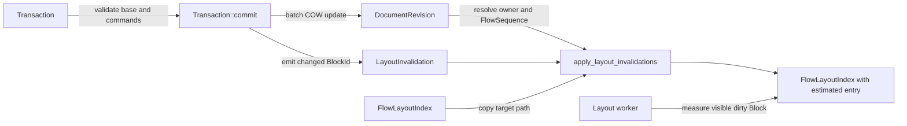
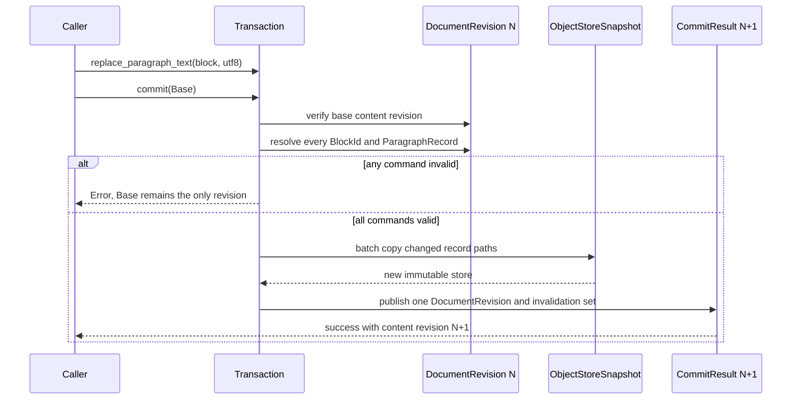

# P1 第一條真實編輯路徑

## 目標與動機

把目前各自存在的 `ObjectStoreSnapshot`、`DocumentRevision`、`FlowSequence` 與
`FlowLayoutIndex` 串成第一條可驗證的編輯路徑：以一個原子 `Transaction` 修改
`ParagraphRecord`，一次發布新 `DocumentRevision`，再只失效受影響 Block 的 layout entry。

同一批工作先把已接受的 TXT／EDT／BND 裁決轉成正式 ADR，並完成 `LAY-0002` 的失效傳播規則，
避免公開 API 先於契約定型。若不做，最直接的風險是一個多命令 transaction 透過既有逐筆更新 API
增加多次 content revision，或把可重建的 layout cache 誤放進權威 snapshot。

## 範圍

### In

- 建立 `TXT-0001`、`EDT-0001`、`BND-0001`，更新能力 README 與決策索引。
- 為文字 shaping、編輯 transaction／layout 失效、display list 邊界建立聚焦 Mermaid 文件。
- 在 `LAY-0002` 定義 shaping、line breaking、extent、paint、hit-test 的失效方向、停止條件與
  reference cache key，並將狀態改為 `Accepted`。
- 新增不可變 `ParagraphRecord`，第一版權威文字使用經驗證的 UTF-8。
- 新增單層 `Transaction` 與 `ReplaceParagraphText` typed command。
- 新增 `DocumentRevision` 的批次 record 更新入口：所有目標先驗證，成功後只增加一次
  `content_revision`，任何失敗不產生部分結果。
- 擴充 `LayoutEntry` 的來源 content revision 與 measured／estimated 狀態。
- 把 transaction 產生的 Block 失效集合套到對應 `FlowLayoutIndex`；只複製目標 entry 到 root 的
  COW 路徑。
- 新增成功、失敗、舊 snapshot 不變、批次原子性與大量文件局部失效測試。

### Out

- 不實作 shaping engine、selection、undo stack、composition UI 或 display list encoder。
- 不實作 Block 插入、刪除、移動 transaction；第一條路徑只修改既有 Paragraph 的文字。
- 不整合 Flutter／Notist，不變更 C ABI。
- 不把 Ink 功能拉進 P1 驗收。
- 不決定需 benchmark 的 TXT-5、EDT-5、ATH-1、BND-5 數值。

### 凍結區

- `IntrusivePtr`、reclamation queue 與 D17 memory order 不修改。
- `FlowSequence` 的分塊、split／merge 與 `LeafKey` 規則不修改。
- Ink sample、BrushStyle 與 erase 資料格式不修改。
- 現有 ObjectId 位元表示與 C ABI error code 數值不重排；若需 revision conflict，只能在末端追加。

## 方案

### 權威資料與衍生 layout 的分界



- `DocumentRevision` 是權威內容；成功 transaction 只發布一個新 revision。
- `LayoutInvalidation` 只描述「哪個 Block 從哪個階段起失效」，不是第二份內容。
- `FlowLayoutIndex` 是可丟棄 cache。文字改變時先保留舊高度作為 estimate，將 entry 標為
  `estimated`；layout worker 量到新高度後再以 `update_extent` 標回 `measured`。
- `apply_layout_invalidations` 由 `LocationIndex` 找 owner 與 leaf，再在固定 leaf 容量內定位 Block。
  它必須核對 layout entry 的 `BlockId`，不一致便拒絕，不能猜測位置。

### 原子 Transaction 流程



### 失效階段

失效方向固定為：

```text
shaping -> line_break -> extent -> paint -> hit_test
```

每個變更只記錄最早失效階段；所有下游階段隱含失效。Paragraph 文字改變從 `shaping` 開始。
若重新量測後 Block 總高度沒變，向父 FlowContainer 的 extent 傳播在此停止；若高度改變，只更新
父容器中代表子容器的那一個 entry，不掃描後續兄弟。

### 複雜度

令 `N` 為文件 Block 數、`P` 為 ObjectStore page-table 深度、`H` 為 Flow tree 高度、`C` 為固定
leaf capacity、`K` 為 transaction 內命令數：

- Transaction 驗證：`O(K × (P + H + C))`。
- 批次 record 更新：每個不同 record page 複製一條 `O(P)` 短路徑；不掃描 `N`。
- 單一 Block layout 失效：`O(H + C + H)`，分別為找 leaf、leaf 內定位、更新聚合路徑。
- 舊、新 revision 共享未修改 page、Flow subtree 與 layout subtree；額外空間與改動路徑成正比。

## 分步實作清單

### 1. 正式化契約

- 新增：
  - `spec/decisions/03-text/TXT-0001-text-shaping-fallback-composition-and-cache.md`
  - `spec/decisions/04-editing/EDT-0001-selection-transaction-and-undo.md`
  - `spec/decisions/07-binding/BND-0001-display-list-buffer-command-and-version.md`
  - `docs/architecture/text-shaping-data-flow.md`
  - `docs/architecture/edit-transaction-and-layout-invalidation.md`
  - `docs/architecture/display-list-boundary-data-flow.md`
- 更新：能力 README、`spec/index.md`、`LAY-0002`、既有 layout 架構文件。
- 完成證據：Markdown read-back、連結檢查、Mermaid fence 檢查及 `git diff --check` 通過。

### 2. ParagraphRecord

- 新增 `include/krepis/paragraph_record.hpp`、`src/paragraph_record.cpp`、
  `tests/paragraph_record_test.cpp`。
- 先寫 UTF-8 正常、截斷序列、overlong、surrogate、超過 U+10FFFF 與 immutable revision 測試，
  確認 RED 後再實作。
- 完成證據：focused test 通過，既有測試仍通過。

### 3. 原子批次 record 更新

- 擴充 `DocumentRevision`，新增只供 transaction 使用的批次更新入口。
- 新增 `include/krepis/transaction.hpp`、`src/transaction.cpp`、`tests/transaction_test.cpp`。
- 先測：兩個 Paragraph 一次更新只增加一個 revision、任一 Block 不存在時全部拒絕、型別錯誤全部
  拒絕、stale base 拒絕、舊 snapshot 內容不變。
- 完成證據：transaction focused test 與 document revision test 通過。

### 4. 增量 layout 失效

- 擴充 `LayoutEntry` 與 `FlowLayoutIndex`，新增保留估計高度的 invalidation 操作。
- 新增 `include/krepis/layout_invalidation.hpp`、`src/layout_invalidation.cpp`、
  `tests/layout_invalidation_test.cpp`。
- 先測：只改目標 entry、舊 index 不變、Block／位置不一致拒絕、重測後狀態回到 measured，以及
  50,000 Block 中修改一項不改變其他 entry。
- 完成證據：focused tests 通過；transaction → invalidation → remeasure 整合測試通過。

### 5. 專案整合與最終驗證

- 更新 `CMakeLists.txt`、`tests/CMakeLists.txt`、README 與 roadmap 的實際狀態。
- 執行 VS Code `Verify` 對應的 configure、Debug build、Debug CTest，再執行 Release build／CTest。
- 完成證據：兩個組態全部測試通過、`git diff --check` 通過、最終 diff 人工審查無未記錄公開契約。

## 驗收條件

1. `ParagraphRecord::create` 對合法 UTF-8 成功，對截斷、overlong、surrogate 與大於 U+10FFFF 的輸入
   回傳 `ErrorCode::invalid_argument`。
2. 含兩個 `ReplaceParagraphText` command 的 transaction 成功後，兩筆文字都更新且
   `content_revision` 只增加 1。
3. 同一 transaction 只要有不存在、非 Paragraph 或重複目標，commit 便失敗；呼叫者仍只持有未改變
   的 base revision，沒有部分更新可取得。
4. transaction 的 base content revision 與輸入 `DocumentRevision` 不符時，以追加且固定數值的
   revision-conflict error code 拒絕。
5. Paragraph 文字修改產生從 `shaping` 開始的 invalidation；套用後只有該 Block 的 layout entry 變為
   `estimated`，舊高度暫作 estimate，其他 entry 的值與狀態不變。
6. layout worker 呼叫 `update_extent` 後，目標 entry 變回 `measured`，prefix extent 與
   `lower_bound_extent` 反映新高度。
7. LayoutIndex 與 FlowSequence 的 BlockId／位置不一致時，失效套用回傳錯誤，不修改輸入 index。
8. 50,000 Block 測試對單一 Paragraph 修改不得遍歷全部 entry；測試以受影響 entry 與持久化 COW
   結果證明局部更新，正式複雜度 benchmark 留在 P1 端到端驗收。
9. Debug 與 Release 的完整 CTest 皆 100% 通過，且沒有停用或跳過測試。

## 風險與回退

| 風險 | 偵測訊號 | 應對 |
|---|---|---|
| 批次更新仍逐命令增加 revision | 兩命令測試得到 `N+2` | 批次 API 必須直接組出單一新 store，再只呼叫一次 `next_content_revision` |
| LayoutIndex 與 FlowSequence 漂移 | 同 position 的 BlockId 不同 | fail closed；拒絕失效結果並要求由 FlowSequence 重建該 LayoutIndex |
| 保留舊高度造成 viewport 短暫估計誤差 | visible dirty Block 尚未重測 | entry 明確標 `estimated`；可見範圍優先重測，禁止把 estimate 當權威保存 |

整體回退方式：新增 API 與型別保持加法式；若第一條路徑未通過驗收，可移除新檔與 additive CMake
條目，既有 ObjectStore、FlowSequence、FlowLayoutIndex 行為不受影響。

## 待裁決問題

無。使用者已於 2026-08-21 明確要求全部採用前次建議並完成上述三項工作。需量測的 TXT-5、
EDT-5、ATH-1、BND-5 仍依法保持未決，不以本計畫猜測數值。

## 完成紀錄（2026-08-21）

- 已完成 `TXT-0001`、`EDT-0001`、`BND-0001`、三份聚焦架構圖與 `LAY-0002` D21；
  `LAY-0002` 狀態改為 Accepted。
- 已完成 `ParagraphRecord`、嚴格 UTF-8 驗證、單層原子 Transaction、批次 record COW 更新、
  typed layout invalidation、跨 Container 過濾與 measured／estimated 狀態轉換。
- WSL／GCC Debug：15/15 通過；WSL／GCC Release：15/15 通過。
- Codex 桌面程序內的 Windows MSVC `Verify` 仍受 `Path`／`PATH` 注入衝突阻擋，但同一提交已由
  GitHub Windows runner 的 MSVC Release configure／build／CTest 通過；跨工具鏈另有 Clang ASan、
  Clang TSan 與 Linux text spikes 通過。證據見
  [`CI run 32491214397`](https://github.com/MiuDog/Krepis/actions/runs/32491214397)。
- 本次 Markdown 目標 read-back 通過；環境沒有 Mermaid CLI，因此只驗證 fence、節點 ID、連結與
  原始碼語法，未做視覺渲染。
- 額外發現：預設 FlowSequence 連續尾插 5,000 個 Block 可重現 LeafKey 間距耗盡 assertion；已寫回
  `LAY-0002` 與 roadmap，屬 P1 大文件驗收前的既有 blocker，不在本計畫凍結範圍內改寫。
