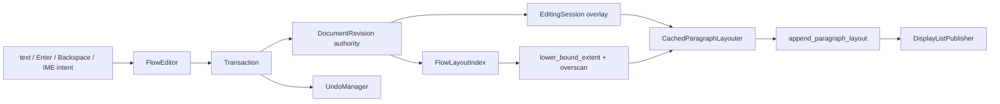

# P1 FlowEditor 核心垂直切片報告

## 狀態

**C++ 核心路徑完成；待 C ABI 與 Notist TextInputClient 接線。**

## 架構與資料流

## 核心不變條件

- Flutter 未來只送 intent；`FlowEditor` 是 selection、composition、undo、layout 與 authority 的唯一組合點。
- 文字修改只失效目標 entry；split 只插入 secondary entry，merge 只移除 secondary entry，
  兩者再失效 primary，不重建整份 `FlowLayoutIndex`。
- Viewport 以累積高度索引定位起點，只排版 visible range 與 240 px overscan。
- Composition 只透過 `EditingSession::composed_paragraph` 進入排版；commit 前 `ParagraphRecord`
  不變，確定後才產生一個不可合併的 undo entry。
- 缺字回 `missing_glyph`，不畫 `.notdef`；測試以 Roboto + Source Han 驗證真實 fallback。

## 具體例

`AB` 在 A／B 之間輸入 X 後是 `AXB`；在 X／B 之間 Enter 產生 `AX` 與 `B`
兩個 stable Block。新 Block 開頭輸入 Y、Backspace 後回到 `B`；再在開頭 Backspace，
核心將兩個 Block 合併為原 primary ID 的 `AXB`。一次 undo 會復原 `AX` / `B` 與原
secondary ID，一次 redo 再合併。

在 `AXB|` 開始注音 composition `知`時，display frame 使用 `AXB知` 排版並畫 caret／
underline，但 authority 仍是 `AXB`。確定後 authority 才變 `AXB知`，undo 一次回復
`AXB`。

## 驗證證據

- `krepis.flow_editor: all checks passed`。
- 完整 Debug：`100% tests passed, 0 tests failed out of 30`。
- 201 Block fixture 在 48 px viewport 下的 paragraph layout cache miss 小於 30，不會為了畫
  第一屏掃過全部 Block。
