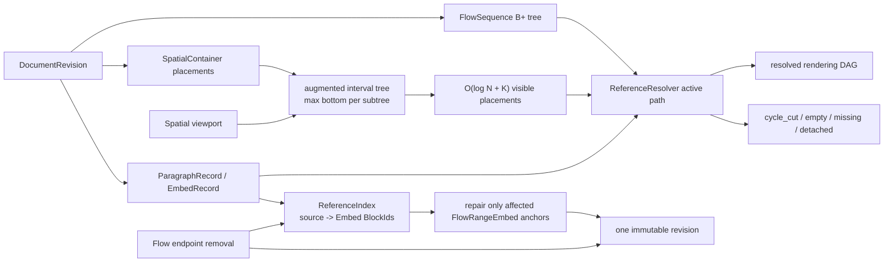

# P1 Spatial 與雙向引用實作報告

## 狀態

**核心完成（2026-08-21）；待 display list 與 Notist 視覺 smoke。**

## 架構與資料流

## 資料結構與複雜度

- Spatial placements 依 `frame.y` 排序，平衡 interval tree 每個節點保存 subtree 最大 bottom。
  viewport 查詢為 `O(log N + K)`，其中 `K` 是相交 placement 數；不從畫布頂端掃到視線位置。
- placement 更新在 P1 重建單一 SpatialContainer 的 immutable index，成本 `O(N log N)`；拖曳與
  resize 尚不在 P1，因此優先讓每幀查詢穩定。若 P2 加入高頻拖曳，需以 workload 決定是否改成
  persistent R-tree。
- `ReferenceIndex` 只保存 stable IDs，不擁有 record。文字 transaction 共享同一 immutable index；
  新增／改指／刪除 Embed 時才 copy-on-write 更新。
- resolver 只檢查目前 active path，不使用全域 visited set。同一 target 出現在不同 sibling branch
  會各自渲染；只有回到祖先 target 才輸出 `cycle_cut`。

## 具體例子

Flow A 有 `[P1, EmbedToSpatial, EmbedToSpatialAgain]`，Spatial B 內有 `EmbedToFlowA`。從 A 開始：
兩個 Spatial Embed 都能展開 B；各自走到 B 的 `EmbedToFlowA` 時，A 已在該分支 active path，於是
只放一個 `cycle_cut` 終止框。第二個 sibling 不會因第一個分支曾看過 B 而被錯誤隱藏。

Flow range anchors 原為 `[Block1, Block3]`。同一 transaction 刪除 Block1 時，reverse index 只找到
引用該 Flow 的 Embed，將 anchor 修成 `[Block2, Block3]`；文件、tombstone、Flow root、locator 與
Embed record 一次從 revision 20 發布成 21。依序刪到 Block3 後 anchors 變成 `[nil, nil]`，顯示
`empty`，不改指頁首。

## 驗證證據

- 2,000 placements × 200 個隨機 viewport，interval tree 結果與線性 reference 完全一致。
- Flow range endpoint 正向／反向收縮、單點刪除、anchor 對調均通過。
- Flow↔Spatial cycle、兄弟分支重複 target、empty／missing／detached 狀態均通過。
- 原子 Flow removal 只增加一次 revision，舊 snapshot 不變，`DocumentRevision::validate()` 通過。
- Dogfood v1.1 round-trip 保存兩種引用、Spatial placements 與重建後的 reverse index。

