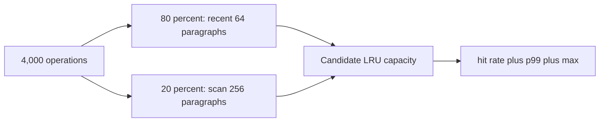

# P1 text layout 與 cache 定案報告

## 結論

- `CachedParagraphLayouter::default_capacity = 256`。
- Release workload 的容量 256：**hit rate 93.6%、p99 0.050 ms、max 0.153 ms**。
- P1 同步文字 layout gate 是 p99 ≤ 3 ms；本次結果保留約 60 倍餘裕。
- 512 與 256 命中率相同，因工作集只有 256 段；512 沒有增加效益，因此不採用。

## 測試架構



每段文字包含英文、數字與標點，寬度固定為 480 px、字級 16 px、行高 20 px。字型固定使用
pin 住的 HarfBuzz source tree 內 `Roboto-Regular.ttf`，不依賴執行機器的系統字型。每個容量執行
4,000 次；80% 模擬游標附近的 64 段熱區，20% 模擬向前捲動完整 256 段工作集。

## Release 結果

實測環境：Windows 11 上的 WSL，GCC 13.3，CMake `Release`，2026-08-21。

| 容量 | 命中率 | p99 | max |
|---:|---:|---:|---:|
| 32 | 4.9% | 0.088 ms | 5.447 ms |
| 64 | 67.875% | 0.075 ms | 0.209 ms |
| 128 | 84.0% | 0.066 ms | 0.118 ms |
| **256** | **93.6%** | **0.050 ms** | **0.153 ms** |
| 512 | 93.6% | 0.049 ms | 0.231 ms |

32 的 max 包含該 process 第一個 HarfBuzz face 初始化，不能拿來比較穩態容量；容量判斷以命中率與
p99 為主。256 到 512 沒增加命中率，p99 差 0.001 ms 屬量測雜訊，卻把 entry 上限加倍。

## Cache key 與失效

完整 key 為：

```text
UTF-8 bytes
language plus base direction
source revision plus composition revision
feature-set revision plus font-set revision
font size plus viewport width plus line height
```

具體例子：注音 composition 從 `ㄓ` 變成候選字 `知` 時，即使正式 Paragraph revision 尚未增加，
`composition_revision` 也會使 cache miss；安裝新字型時 `font_set_revision` 使舊 fallback 與 glyph
結果全部失效；只改 viewport width 也會重算換行。

## 正確性閘門

- 第一次 shaping 只估算 advance；選定行範圍後，以 SheenBidi line-level L1／L2 重新排序並由
  HarfBuzz reshaping。
- reshaping 若使寬度變大，會把最後一個合法單元移到下一行並再次 shaping；不把它誤標成 overflow。
- 只有完全沒有內部候選點的 URL／path 才保留單一 overflow line。
- baseline、natural height 與 line gap 取自實際 HarfBuzz font extents。
- grapheme caret stop 含 combining sequence 與 ligature cluster 的內部分配，不落在 UTF-8 continuation byte。

## 可重現命令

```powershell
cmake -S . -B build/wsl-text-release -DCMAKE_BUILD_TYPE=Release
cmake --build build/wsl-text-release --target bench_text_layout_cache -j2
build/wsl-text-release/spikes/bench_text_layout_cache
```
