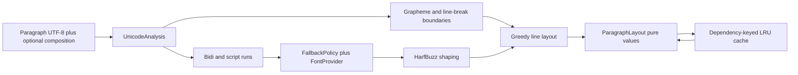
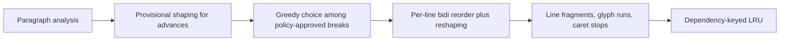

# P1 正式文字 layout 執行計畫

## 狀態

**已由 P1 主計畫核准，進行中（2026-08-21）**。依賴／canonical UTF-8 與 2A Unicode analysis
與 2B fallback／shaping 已完成；目前進入 2C line layout／cache benchmark。本計畫只細化主計畫
第 2 階段，不擴張 In／Out，
也沒有新增人工決策。

## 目標

把已通過 spike 的 HarfBuzz、libunibreak、SheenBidi 從列印型驗證程式提升為 Krepis 正式、可測、
純值輸出的文字 layout 路徑。第一個完成切片必須接受 UTF-8 Paragraph、產生 grapheme 邊界、候選
斷點、bidi／script runs、fallback font runs、glyph runs 與 line fragments；任何平台 handle 都留在
`FontProvider` adapter 之外。

## 版本與一手來源

| 依賴 | 已驗證版本 | 固定 commit | 正式用途 |
|---|---|---|---|
| HarfBuzz | 10.1.0 | `c11b534f6e95663368bf3b93d7457db92bda7227` | OpenType shaping、glyph metrics、cluster mapping |
| libunibreak | 6.1 | `304585d8e2d63187507368d612c3d5fff1486368` | UAX #14 候選斷點、UAX #29 grapheme |
| SheenBidi | 2.8 | `488ba0fcc323efdf596c4821a2351ef98ec1bd0e` | UAX #9 bidi runs、UAX #24 script runs |

官方依據：

- HarfBuzz shaping buffer：<https://harfbuzz.github.io/harfbuzz-hb-shape.html>
- HarfBuzz buffer 與 cluster level：<https://harfbuzz.github.io/harfbuzz-hb-buffer.html>
- HarfBuzz cluster 說明：<https://harfbuzz.github.io/working-with-harfbuzz-clusters.html>
- libunibreak 官方 repository 與 public interface 說明：<https://github.com/adah1972/libunibreak>
- SheenBidi 官方 API overview：<https://github.com/Tehreer/SheenBidi>
- CMake 3.24 FetchContent：<https://cmake.org/cmake/help/v3.24/module/FetchContent.html>

上游目前的 SheenBidi 文件可能描述較新版本；實作簽名以固定 commit 的 `Headers/` 為最終依據，
不得把 3.x API 無意帶進已驗證的 2.8。

## 資料流



## API 形狀

### 2A：Unicode analysis

```text
TextAnalysis {
    grapheme_boundaries[] byte offsets
    line_breaks[] {byte_offset, allowed|mandatory}
    bidi_runs[] {byte_offset, byte_length, embedding_level}
    script_runs[] {byte_offset, byte_length, open_type_tag}
}
```

- 所有 offset 都是原始 UTF-8 byte offset，範圍為 `[0, text.size()]`。
- grapheme boundaries 必含 0 與 `text.size()`，游標只能落在其中。
- libunibreak 先產生候選點；核心再移除 URL、Windows path、UNC path 與 POSIX absolute path token
  內部斷點。例：`請看 https://example.com/path 再說` 可在 URL 前後斷，不可在兩個 `/` 後斷。
- bidi runs 依 SheenBidi 的 `SBLineGetRunsPtr()` 保留視覺順序與 embedding level；不自行反轉數字。
- script runs 依固定 2.8 的 `SBScriptLocator`，再用 `SBScriptGetOpenTypeTag()` 保存可供 shaping 轉換的
  tag。

### 2B：font fallback 與 shaping

```text
FontProvider {
    font_set_revision()
    candidates(script_tag, language)
    open(font_id) -> {font bytes, face index}
}

GlyphRun {
    font_id, byte_range, direction, script_tag
    glyphs[] {glyph_id, cluster_byte_offset, advances, offsets}
}
```

- `FontProvider` 只提供字型候選與 bytes；不能提交已挑好的 fallback 結果。
- fallback 以完整 grapheme 為最小單位，避免 emoji／combining sequence 被拆到兩個字型。
- 每個候選 font 的 coverage 先建立 script-indexed cache；不得每字元掃描全部系統字型。
- HarfBuzz buffer 明確設定 direction、script、language 與
  `HB_BUFFER_CLUSTER_LEVEL_MONOTONE_CHARACTERS`；輸出 cluster 必須回到原 Paragraph byte offset。
- `.notdef` 不可靜默接受；所有候選都缺 glyph 時回明確錯誤並指出第一個缺字 byte offset。

### 2C：line layout 與 cache

```text
ParagraphLayout {
    source_revision, width, total_height
    lines[] {byte_range, baseline, width, glyph_run_range}
    glyph_runs[]
    caret_stops[]
}
```

- line breaker 只使用 2A 通過政策過濾的候選點；超長且沒有候選點的 token 保留 overflow，不任意切 byte。
- cache key 完整包含 text/composition revision、font-set revision、font size、width、language、direction、
  feature set；值只含純資料。
- cache 容量、淘汰門檻與同步 shaping 佔比由 TXT-5 benchmark 定案。

line layout 採兩階段，不直接依 byte offset 切割 2B 已產生的 glyph runs：



原因：若把整段 Arabic 的 glyph run 在選定 byte offset 後直接切成兩半，行尾／行首字母的 joining
form 仍會保留「原本相鄰」的形狀；若沿用整段的 bidi 視覺順序，UAX #9 的 line-level 重排也可能錯。
因此第一次 shaping 只供寬度估算，確定每行 byte range 後必須逐行重排與重塑。超長且無候選斷點的
URL 仍形成單一 overflow line，不退化成任意 grapheme 切割。

## 實作順序與驗收

### 1. 依賴與 canonical UTF-8

**狀態：✅ 完成（2026-08-21）。**

- 把三個依賴以固定 SHA 移到 production dependency module；CMake 3.24 以明確
  `add_subdirectory(... EXCLUDE_FROM_ALL)` 或自建 target 隔離 install／ALL。
- 抽出單一 UTF-8 validator，`ParagraphRecord` 與 text analysis 共用，不複製規則。
- 驗收：離線 source override 可 configure；未知／不完整 UTF-8 在進第三方庫前拒絕。

完成證據：三個固定 SHA 由 `cmake/KrepisTextDependencies.cmake` 私有載入；離線 source override
完成 configure／build；UTF-8 與 Paragraph 聚焦測試全綠。

### 2. Unicode analysis

**狀態：✅ 完成（2026-08-21）。**

- 先寫 invalid UTF-8、空字串、注音 combining、emoji ZWJ、CJK 禁則、URL、Windows／UNC／POSIX path、
  阿拉伯文含 2026 與 script 混排測試。
- 實作 RAII wrapper，所有 SheenBidi create/release 必須一一配對。
- 驗收：所有 offset 在合法 byte boundary；數字 run level 為偶數；URL／path 內部無候選斷點。

完成證據：17/17 Debug 測試全綠；fixture 覆蓋 invalid UTF-8、空字串、combining sequence、emoji ZWJ、
CJK 句號、URL、Windows／UNC／POSIX path，以及 Latin／Arabic／2026／Han 混排；三個原 spike
executable 亦使用正式 target 後成功執行。

### 3. Fallback 與 shaping

**狀態：✅ 完成（2026-08-21）。**

- 測試使用 repository fixture fonts，不依賴執行機器碰巧安裝的字型。
- 先測單字型、CJK fallback、combining sequence、RTL、缺字 fail-closed、cluster 回映。
- 驗收：沒有平台 handle、沒有 `.notdef` 靜默輸出、同輸入同 font bytes 得到穩定值結果。

完成證據：測試固定使用已 pin 的 HarfBuzz source tree 內 Roboto、Source Han Sans 與 Amiri fixture，
不讀系統安裝字型。具體例子 `A倅` 先讓 Roboto 接受 `A`，再因缺 U+5005 而選第二候選 Source Han；
emoji U+1F984 在所有候選都缺字時回 `missing_glyph` 與 byte offset 1，不輸出 `.notdef`。同一
font-set revision 重用候選／face coverage cache，revision 遞增後兩者都強制清除。

### 4. Line layout 與 cache benchmark

**狀態：進行中。**

- 先完成不帶 cache 的正確路徑，再加入 dependency-keyed LRU。
- 量測 cache 候選容量與 TXT-5 同步路徑 p99；偏離建議值時記錄額外測試。
- 驗收：P1 的 p99 ≤ 3 ms；composition overlay 改變 cache key、換行、extent 與 caret。

## 風險與回退

| 風險 | 偵測 | 應對 |
|---|---|---|
| 上游 tag 被移動 | 乾淨建置取到不同來源 | 只 pin commit SHA，版本名稱僅供閱讀 |
| SheenBidi 3.x 文件污染 2.8 實作 | 本地固定 header 沒有該 API | 以固定 commit header 為準，文件標示版本差異 |
| byte／code point offset 混用 | cluster、caret 或 run 越界 | 所有公開 offset 命名 `byte_offset`，fixture 驗證 UTF-8 邊界 |
| fallback 拆開 grapheme | combining mark／emoji 使用不同 font | fallback 最小單位固定為 2A grapheme range |
| URL policy 過度禁止 | 長 token overflow 過多 | 第一版只辨識明確 scheme／path prefix；以 fixture 擴充，不用模糊猜測 |
| 依賴污染消費端 install | package 出現上游 target／header | dependency subdirectory `EXCLUDE_FROM_ALL`，Krepis 只 private link |

## 需要使用者再決策的項目

**目前沒有。** dependency、fallback authority、URL policy 與 cache 原則都已由 FND-0003／TXT-0001
接受；cache 數值屬 benchmark，不是人工選項。
