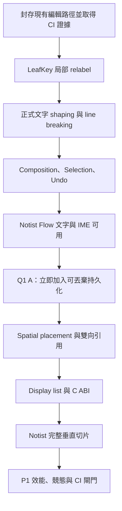

# P1 垂直切片執行計畫

## 狀態

**已核准（2026-08-21）**。使用者核准全部建議，並對唯一需要裁決的時點問題選擇 **Q1：A**：
Notist 一旦能實際使用 Flow 文字與 IME，立即加入可丟棄的本機持久化，再繼續完成 Spatial 與
其餘 P1 工作。

## 進度紀錄

| 階段 | 狀態 | 證據 |
|---|---|---|
| 0. 封存目前成果並恢復完整驗證 | ✅ 完成 | 三個基線提交；PR #1 的 MSVC、ASan、TSan、Linux text spikes 全綠 |
| 1. `LeafKey` 局部 relabel | ✅ 完成 | `f545fee`；100k 三模式 gate、原子 locator、stale root、舊 snapshot 與 benchmark |
| 2. 正式文字 layout | **進行中** | 子計畫：[`p1-text-layout-plan-20260821.md`](p1-text-layout-plan-20260821.md) |
| 3–7 | 未開始 | 依本計畫順序執行 |

遠端證據：[`CI run 32491214397`](https://github.com/MiuDog/Krepis/actions/runs/32491214397)、
[`PR #1`](https://github.com/MiuDog/Krepis/pull/1)。

## 目標與動機

完成 Windows 上第一條可每天使用、可量測且能證明架構成立的垂直路徑：同一份不可變文件資料
經過編輯、文字 shaping、增量 layout、display list 與 C ABI，最後由 Notist 顯示；Flow 與 Spatial
能互相唯讀引用，來源修改在同一幀反映。

先解決已重現的 `LeafKey` 間距耗盡，避免大量筆記區塊在正式 UI 出現前就讓順序索引失效。Flow
文字與 IME 可用後提前加入暫用存檔，目的是盡早 dogfood；該格式不是未來 authority 格式。

## 範圍

### In

- 完成並驗證目前的 Paragraph、Transaction 與 typed layout invalidation 成果。
- 實作 `LeafKey` 局部 relabel，並讓 `FlowSequence` 與 `LocationIndex` 在同一 revision 一致發布。
- 完成正式文字 shaping、line breaking、composition、selection、undo／redo。
- 完成 P1 最小 Spatial placement 與 Flow／Spatial 雙向唯讀引用。
- 完成 display list encoder／checked decoder、雙緩衝與 C ABI。
- 串起 Notist 的輸入、IME、layout、render 垂直路徑。
- 依 Q1：A，在 Flow 文字與 IME 可用後立刻加入可丟棄的本機持久化。
- 完成 Debug、Release、ASan、TSan、CI、120 Hz 與大文件複雜度閘門。

### Out

- 不實作正式 authority、身分、權限、協作協定或離線 merge。
- 不把暫用持久化格式承諾為長期 schema；P4 必須替換。
- 不實作 Spatial 的平移／縮放、z-order、群組、連接線或多種節點型別。
- 不把 Ink 輸入、擦除、lasso、Ink undo 納入 P1；既有 Ink 資料模型保留。
- 不猜測需要量測的常數，包括 relabel window、估計高度、overscan、cache 與 buffer 尺寸。

## 相依順序

這張圖表達的是交付依賴，不是執行緒呼叫鏈。能安全平行的測試、文件與 wrapper 工作可在各階段內
交錯，但不得繞過前一階段的公開契約。

## 分步執行

### 0. 封存目前成果並恢復完整驗證

- 把 ADR／架構文件、Paragraph／Transaction、layout invalidation 分成可讀的邏輯提交。
- 在乾淨的 MSVC Developer PowerShell 執行 Verify；本機環境若仍阻擋，以 GitHub Windows CI 作為
  MSVC 證據，但不把環境錯誤寫成程式通過。
- 推送 `codex/p1-vertical-slice`，確認 MSVC、Linux、ASan 與 TSan workflow 全綠。

完成證據：GitHub workflow 結果、Debug／Release 測試尾行與 `git diff --check`。

### 1. `LeafKey` 局部 relabel

**狀態：完成（2026-08-21）。** 初始 window 經實測定案為 64；完整數據見
[`lay-0002-leaf-key-relabel-report.md`](lay-0002-leaf-key-relabel-report.md)。

- 先加入能重現預設設定連續頭插、尾插與中間插入的失敗測試。
- midpoint 不存在時選取鄰近 leaf window，視可用 128-bit 區間幾何擴張 window，均勻重編號。
- edit result 明確列出 key 改變的 leaves；transaction 只更新那些 leaf 內 Block 的
  `LocationIndex`，再與新 `FlowSequence` 原子發布。
- 只有整個可用區間仍無法留出空間時才全域 rebuild，並增加 `storage_generation`。
- 暴露 relabel 次數、window 大小與 global rebuild 次數，供 benchmark 與診斷使用。

具體例子：若相鄰 keys 已是 `1000, 1001`，不能再取中點。系統可把鄰近四個 leaves 從
`1000, 1001, 1002, 1003` 重排為 `1000, 2000, 3000, 4000`；只有這四個 leaves 的 locator 需要更新，
其他 Block 的 stable ID 與順序不變。

完成證據：100,000 Block 的頭／尾／中間插入不 assertion；舊 snapshot 仍可讀；順序、stable ID、
LocationIndex invariant 全部成立，且操作不退化為每次全文件掃描。

### 2. 正式文字 layout

- 建立 grapheme boundary、雙向文字、字型提供與 fallback、HarfBuzz shaping、line breaking。
- 產出純值型別的 `GlyphRun`、`LineFragment`、`ParagraphLayout`，不得把平台 handle 穿過 C ABI。
- shaping cache key 至少涵蓋文字 revision、樣式、字型環境、可用寬度與方向；容量由 benchmark 定。
- URL／路徑等斷行政策以 fixture 固定，避免不同平台或 library 預設靜默改變。

完成證據：中英混排、注音、emoji grapheme、RTL、fallback 與極長不可斷 token fixture；cache
命中／失效測試與正式 benchmark。

### 3. Composition、Selection 與 Undo

- `TextAnchor` 以 stable BlockId 與文字內位置表示；不保存 transient leaf key 或畫面座標。
- composition 是本機 overlay，不提前寫入權威文字；Block 移動時保留，Block 刪除時取消。
- 遠端正式文字插入依已接受規則調整 anchor；確定 composition 時以單一 replace-range transaction
  寫入，Esc 只取消 overlay。
- 先只建立 `TextSelection` 與 `SpatialSelection`；跨類型選取不合併成模糊 union 行為。
- undo 以已提交 transaction 為單位；composition 的一次確定是一個 undo 單位，合併規則依 command
  類型判斷。

具體例子：A 正在 `AB|CD` 的游標位置組字，B 把該 Block 移動到另一位置時，A 仍在相同 BlockId
內繼續組字；若 B 刪除該 Block，A 的 composition 才取消。B 看不到 A 尚未確定的注音字串。

完成證據：注音組字／選字／確定／取消、Block move／delete、並行插入、一次確定一次 undo 的
狀態測試與 Notist 手動驗收。

### 4. Q1：A 的提前 dogfood 切點

Notist 的 Flow 文字、游標、IME 與 undo 可用後，**在完整 Spatial 之前**加入最小本機存檔／載入。
格式可直接保存當前 P1 權威內容與必要 stable ID，但必須有明確 magic、版本與「可丟棄」標記；讀到
未知版本時 fail closed，不做猜測式修復。

具體例子：今天建立三個 Paragraph、關閉 Notist、隔天開啟後文字、順序與 BlockId 相同即可；不要求
此檔案能被 P4 authority 直接讀取，也不要求跨裝置同步。

完成證據：round-trip、截斷檔案、未知版本、原子替換存檔與重開 Notist smoke test。若納入 Ink
dogfood，必須同時保存 `InkStroke` 與 `BrushStyle`；否則不得宣稱 Ink 已可存檔。

### 5. Spatial 與雙向引用

- Spatial P1 只保存 viewport 內的 frame 位置、尺寸與來源比例。
- Flow 可嵌入 Spatial viewport；Spatial 可嵌入 Flow Block range。引用只讀、不取得 ownership。
- 從引用起點建立 rendering DAG；資料中可存在 cycle，但當前渲染路徑重複遇到相同來源時停止，
  視覺上不顯示循環。
- Flow range 使用 stable start／end BlockId；端點刪除時向區間內側收縮，最後一個節點刪除後不顯示。

完成證據：雙向引用同幀更新、端點刪除／對調、循環不顯示、同一來源被不同非循環分支引用的測試。

### 6. Display list 與 C ABI

- 依 `BND-0001` 完成固定 header、opcode／TLV、checked decoder 與版本 fail-closed。
- arena／雙緩衝的配置與釋放責任可機械檢驗；Dart 只取得 read-only span 與 frame token。
- 公開邊界只使用 C 型別、status code、明確執行緒契約與單一釋放責任。
- 第一版先提供同步呼叫；背景 handoff 只有在 profiler 證明需要時才擴充。

完成證據：round-trip property test、惡意長度／未知 opcode／版本測試、配置數等於釋放數、舊 frame
token 不得讀到覆寫資料，以及 Dart FFI smoke test。

### 7. Notist 完整垂直切片與最終閘門

- 串起事件 → C ABI → Transaction → shaping → layout → display list → Flutter paint。
- 顯示 Flow 與 Spatial 頁面及互相引用；Flutter 外殼不得複製文件或 layout 權威。
- 驗證 120 Hz 捲動、IME、undo、同幀引用與大文件打字。

完成證據：P1 roadmap 的所有機器驗收條件；Debug／Release／MSVC／GCC 或 Clang、ASan、TSan 與
GitHub CI 全部通過。單字編輯的重算節點數不得隨文件 Block 總數成長，端到端 p99 layout＋display
list 預算不得超過 P0 gate。

## 量測後自動選擇的參數

下列項目不是新的人工決策。採用滿足正確性後全局表現最佳的實測值，並把 workload、候選值、原始
數據與回歸門檻記入報告：

- LeafKey relabel 初始 window 與目標間距。
- 未量測 Paragraph 的估計高度與 viewport overscan。
- shaping cache 容量與淘汰門檻。
- undo merge 時間窗。
- display list arena／buffer 尺寸，以及 `BND-0001` 的 BND-5 數值。
- authority handoff 的 ATH-1 數值。

若實測最佳值不是既有文件的建議值，必須標註偏離原因、增加針對衍生風險的測試，不能只改常數。

## 風險與回退

| 風險 | 偵測訊號 | 應對與回退 |
|---|---|---|
| relabel 讓 sequence 與 locator 分叉 | invariant test 找到 owner／leaf 不一致 | 整筆 transaction fail closed；不發布半套 snapshot |
| 文字 library 整合改變斷行 | fixture 或 golden 變動 | 固定版本與輸入；只在有說明的決策更新後重設基準 |
| 暫用存檔滲透成正式格式 | P2／P4 程式依賴其內部 layout | codec 放在清楚的 provisional 邊界；P4 直接替換，不做無期限相容 |
| Flutter 成為第二份權威 | Dart state 能修改內容而未經 C++ transaction | 外殼只送 intent／event；移除該鏡像 state |
| 效能只在小文件假性通過 | 3 個數量級內曲線平坦但未跨過常數項 | 增加規模直到趨勢可辨，記錄節點訪問數而非只看時間 |

各階段使用加法式 API 與獨立提交。若某階段未過 gate，回退該階段提交並保留前一個已驗證切片；
不得靠停用測試、放寬 baseline 或吞掉錯誤推進。

## 需要使用者再決策的項目

**目前沒有。** Q1 已選 A；其他未定數值均屬 benchmark 結果。只有遇到會改變上述 In／Out、公開
語意或要求新增 authority／協作範圍的情況，才重新送人工裁決。
